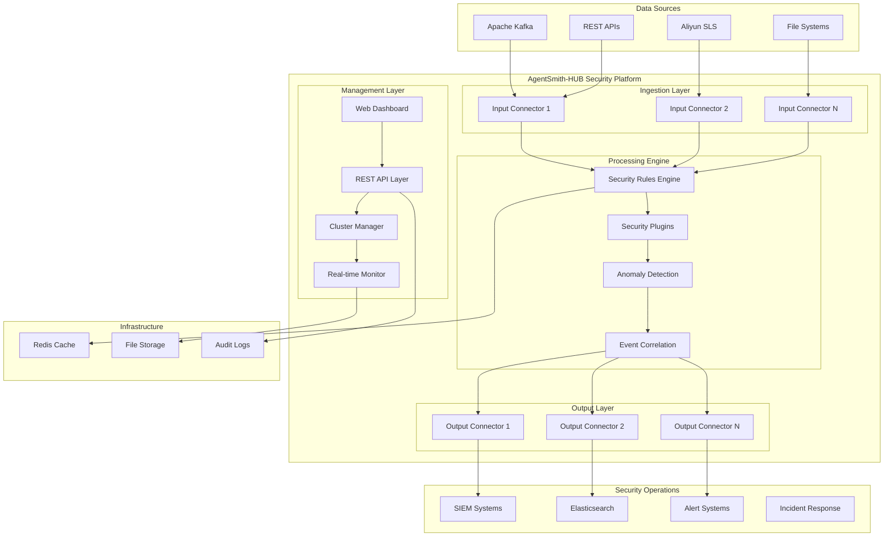

# 🛡️ AgentSmith-HUB

> **Enterprise Security Data Pipeline Platform (SDPP) with Integrated Real-Time Threat Detection Engine**

AgentSmith-HUB is a next-generation **Security Data Pipeline Platform** designed to provide comprehensive security data processing, real-time threat detection, and automated incident response capabilities. Built with a high-performance Go backend and modern Vue3 frontend, it enables security teams to build, deploy, and manage sophisticated detection and response workflows at enterprise scale.

## 🚀 Core Platform Capabilities

### 🔍 **Real-Time Security Detection Engine**
- **Advanced XML Rules Engine** - Flexible rule-based threat detection with 30+ check types and complex logic combinations
- **Built-in Security Plugins** - 25+ pre-built security functions including IP geolocation, CIDR matching, threat intelligence integration
- **Custom Plugin Framework** - Extensible Go-based plugin system for specialized detection logic
- **Threshold & Anomaly Detection** - Statistical analysis with COUNT, SUM, and CLASSIFY modes for behavioral analytics
- **Real-time Processing** - Low-latency concurrent processing with automatic scaling

### 🌐 **Security Data Pipeline Platform**
- **Multi-Source Data Ingestion** - Native support for Kafka, Aliyun SLS, file systems, and custom data sources
- **Flexible Data Transformation** - Real-time data enrichment, normalization, and correlation
- **Intelligent Output Routing** - Dynamic routing to Elasticsearch, Kafka, SIEM systems, and alert channels
- **Stream Processing Architecture** - High-throughput data processing with backpressure handling
- **Data Quality Assurance** - Built-in validation and error handling for reliable data flows

### 🏗️ **Enterprise-Grade Management**
- **Visual Workflow Designer** - Intuitive drag-and-drop interface for building complex security data flows
- **Cluster Management** - Leader-follower architecture with automatic failover and load balancing
- **Change Management** - Safe 3-step deployment process (Save → Verify → Apply) with rollback capabilities
- **Comprehensive Monitoring** - Real-time QPS metrics, system health monitoring, and performance analytics
- **Audit & Compliance** - Complete audit trails with detailed operation history and error logging

### 🛠️ **Developer & Operations Tools**
- **Modern Web Interface** - Vue3-based dashboard with Monaco Editor for real-time rule editing
- **API-First Architecture** - RESTful APIs with 60+ endpoints for programmatic management
- **MCP Protocol Support** - Model Context Protocol integration for AI-powered security operations
- **Testing & Validation** - Comprehensive testing framework for rules, components, and data flows
- **Configuration Management** - YAML-based configuration with template generation and validation

## 🏛️ System Architecture



## 🚀 Quick Start Guide

### Prerequisites
- **Go 1.21+** - Backend runtime environment
- **Node.js 18+** - Frontend development tools
- **Redis 6.0+** - Caching and session management (optional)
- **Kafka/Elasticsearch** - Data sources and destinations (optional)

### 1. Installation & Setup

```bash
# Clone the repository
git clone https://github.com/your-org/AgentSmith-HUB.git
cd AgentSmith-HUB

# Build the backend
cd src
go mod tidy
go build -o agentsmith-hub

# Build the frontend
cd ../web
npm install
npm run build
```

### 2. Configure Security Platform

```bash
# Create configuration directory
mkdir -p config/{input,output,ruleset,project}

# Set environment variables for optimal performance
export CGO_LDFLAGS=-L/path/to/AgentSmith-HUB/lib/darwin
export LD_LIBRARY_PATH=/path/to/AgentSmith-HUB/lib/darwin
```

### 3. Launch Security Platform

```bash
# Start as cluster leader
./agentsmith-hub -config_root ./config -token "your-secure-token"

# Access the security dashboard
open http://localhost:8080
```

### 4. Scale with Cluster Nodes

```bash
# Add follower nodes for high availability
./agentsmith-hub -leader leader-node-ip:8080 -token "your-secure-token"
```

## 🔧 Security Data Pipeline Configuration

### Input Component Configuration
```yaml
name: "Kafka Security Events"
type: "kafka"
kafka:
  brokers: ["kafka1:9092", "kafka2:9092"]
  topic: "security-events"
  group: "threat-detection"
  compression: "snappy"
  sasl:
    enable: true
    mechanism: "plain"
    username: "${KAFKA_USER}"
    password: "${KAFKA_PASS}"
batch_size: 1000
flush_interval: "5s"
```

### Security Rules Engine Configuration
```xml
<root name="Advanced Threat Detection" type="DETECTION">
  <rule id="apt_powershell_detection" name="APT PowerShell Attack Detection">
    <!-- Real-time command analysis -->
    <append type="PLUGIN" field="decoded_cmd">base64Decode(_$command_line)</append>
    
    <!-- Multi-stage detection logic -->
    <check type="INCL" field="process_name">powershell</check>
    <check type="INCL" field="decoded_cmd" logic="OR" delimiter="|">
      System.Net.WebClient|DownloadString|IEX|Invoke-Expression
    </check>
    
    <!-- Behavioral analysis -->
    <threshold group_by="hostname,user" range="10m" value="3"/>
    
    <!-- Threat intelligence enrichment -->
    <append type="PLUGIN" field="threat_score">
      calculateThreatScore(_$decoded_cmd, _$source_ip, _$user_context)
    </append>
    
    <!-- Automated response -->
    <plugin>isolateHost(_$hostname)</plugin>
    <plugin>generateIOCs(_$ORIDATA)</plugin>
  </rule>
  
  <rule id="data_exfiltration_detection" name="Data Exfiltration Detection">
    <!-- Sensitive data access detection -->
    <check type="INCL" field="file_path" logic="OR" delimiter="|">
      /etc/passwd|/etc/shadow|.ssh/|.aws/credentials|database.sql
    </check>
    
    <!-- Network behavior analysis -->
    <check type="PLUGIN">!isPrivateIP(_$dest_ip)</check>
    <threshold group_by="user_id" range="1h" count_type="SUM" 
               count_field="bytes_transferred" value="1073741824"/>
    
    <!-- Risk scoring and classification -->
    <append type="PLUGIN" field="data_classification">
      classifyDataSensitivity(_$file_path, _$file_content)
    </append>
    
    <!-- Immediate containment -->
    <plugin>blockDataTransfer(_$source_ip, _$dest_ip)</plugin>
    <plugin>triggerIncidentResponse(_$ORIDATA)</plugin>
  </rule>
</root>
```

### Output Component Configuration
```yaml
name: "Security Analytics Engine"
type: "elasticsearch"
elasticsearch:
  hosts: ["https://es1:9200", "https://es2:9200"]
  index: "security-alerts-{yyyy.MM.dd}"
  batch_size: 1000
  flush_interval: "10s"
  pipeline: "security-enrichment"
  auth:
    username: "${ES_USER}"
    password: "${ES_PASS}"
  ssl:
    verify_certificates: true
    ca_cert: "/path/to/ca.crt"
```

### Project Workflow Configuration
```yaml
id: "enterprise_threat_detection"
name: "Enterprise Threat Detection Pipeline"
content: |
  # Multi-stage security data processing workflow
  INPUT.kafka_security_events -> RULESET.threat_detection_rules
  INPUT.syslog_events -> RULESET.system_anomaly_detection
  
  # Correlation and enrichment
  RULESET.threat_detection_rules -> RULESET.threat_intelligence_enrichment
  RULESET.system_anomaly_detection -> RULESET.behavioral_analysis
  
  # Output routing based on severity
  RULESET.threat_intelligence_enrichment -> OUTPUT.high_priority_alerts
  RULESET.behavioral_analysis -> OUTPUT.security_analytics_engine
  
  # Automated response workflows
  OUTPUT.high_priority_alerts -> OUTPUT.incident_response_system
  OUTPUT.security_analytics_engine -> OUTPUT.compliance_reporting
```

## 🔍 Advanced Security Features

### Built-in Security Plugins
```go
// IP and Network Analysis
isPrivateIP(_$source_ip)              // Check if IP is private
cidrMatch(_$ip, "10.0.0.0/8")        // CIDR range matching
geoMatch(_$ip, "US")                  // Geographic location validation

// Threat Intelligence Integration
virusTotal(_$file_hash)               // VirusTotal hash lookup
shodan(_$ip_address)                  // Shodan infrastructure intelligence
threatBook(_$indicator, "ip")         // ThreatBook intelligence queries

// Data Processing & Encoding
base64Decode(_$encoded_data)          // Base64 decoding
hashSHA256(_$sensitive_data)          // SHA256 hash generation
parseJSON(_$json_logs)                // JSON log parsing
regexExtract(_$log, "IP: (\\d+\\.\\d+\\.\\d+\\.\\d+)")  // Pattern extraction

// Time-based Analysis
now()                                 // Current timestamp
hourOfDay()                           // Hour-based analysis
dayOfWeek()                           // Day-based patterns

// Alert Suppression
suppressOnce(_$alert_key, 300, "rule_id")  // Prevent alert flooding
```

### Security Use Cases

#### 1. **APT (Advanced Persistent Threat) Detection**
- PowerShell Empire C2 detection
- Lateral movement identification
- Command and control traffic analysis
- Data exfiltration prevention

#### 2. **Financial Fraud Detection**
- Real-time transaction monitoring
- Account takeover detection
- Money laundering pattern recognition
- Behavioral anomaly detection

#### 3. **Network Security Monitoring**
- DDoS attack detection
- Port scanning identification
- DNS tunneling detection
- Malware communication analysis

#### 4. **Compliance & Audit**
- Data access monitoring
- Privileged account tracking
- Regulatory compliance reporting
- Security policy enforcement

## 📊 Real-Time Security Operations

### Security Dashboard Features
- **Live Threat Feed** - Real-time security event visualization
- **Attack Timeline** - Chronological view of security incidents
- **Geo-location Mapping** - Global threat visualization
- **Performance Metrics** - Processing rates and system health
- **Alert Management** - Centralized security alert handling

### Monitoring & Analytics
```bash
# Real-time security metrics
curl -H "token: your-token" http://localhost:8080/system-metrics

# Security event statistics
curl -H "token: your-token" http://localhost:8080/qps-data?project_id=threat_detection

# Cluster security status
curl -H "token: your-token" http://localhost:8080/cluster-status

# Security operations history
curl -H "token: your-token" http://localhost:8080/operations-history
```

## 🔐 Security & Authentication

### Authentication & Authorization
- **Token-based API Authentication** - Secure API access control
- **Session Management** - Secure web interface sessions
- **Role-based Access Control** - Granular permission management
- **Audit Logging** - Complete access and operation tracking

### Network Security
- **TLS/SSL Support** - Encrypted communication channels
- **Network Segmentation** - Isolated security zones
- **Firewall Integration** - Network-level security controls
- **VPN Support** - Secure remote access

### Data Protection
- **Encryption at Rest** - Sensitive data encryption
- **Data Masking** - PII protection in logs
- **Secure Key Management** - Cryptographic key handling
- **Compliance Ready** - GDPR, HIPAA, SOX compliance support

## 🚀 Performance & Scaling

### High-Performance Architecture
- **Concurrent Processing** - Multi-goroutine parallel processing
- **Memory Optimization** - Efficient memory usage patterns
- **Connection Pooling** - Optimized database connections
- **Caching Strategy** - Redis-based performance caching

### Scalability Features
- **Horizontal Scaling** - Add nodes for increased capacity
- **Load Balancing** - Distribute processing load
- **Auto-scaling** - Dynamic resource allocation
- **Performance Monitoring** - Real-time performance tracking

### Capacity Planning
```bash
# System resource monitoring
curl -H "token: your-token" http://localhost:8080/system-stats

# Processing capacity analysis
curl -H "token: your-token" http://localhost:8080/cluster-system-metrics

# Performance optimization recommendations
curl -H "token: your-token" http://localhost:8080/plugin-stats
```

## 🔧 Development & Integration

### API Integration
```bash
# Security rule management
POST /rulesets                    # Create security rules
GET /rulesets/{id}               # Retrieve rule configuration
PUT /rulesets/{id}               # Update security rules
DELETE /rulesets/{id}            # Remove security rules

# Threat detection testing
POST /test-ruleset/{id}          # Test detection rules
POST /test-project/{id}          # Test complete workflows
POST /verify/ruleset/{id}        # Validate rule syntax

# Real-time monitoring
GET /qps-data                    # Processing statistics
GET /error-logs                  # Security operation logs
GET /operations-history          # Audit trail
```

### Custom Plugin Development
```go
// Example: Custom threat scoring plugin
package main

import (
    "encoding/json"
    "fmt"
    "strings"
)

// ThreatContext represents threat analysis context
type ThreatContext struct {
    SourceIP        string            `json:"source_ip"`
    UserAgent       string            `json:"user_agent"`
    RequestCount    int               `json:"request_count"`
    GeoLocation     string            `json:"geo_location"`
    ThreatFeatures  map[string]float64 `json:"threat_features"`
}

// CalculateThreatScore performs advanced threat scoring
func CalculateThreatScore(context ThreatContext) float64 {
    score := 0.0
    
    // IP reputation scoring
    if isKnownMaliciousIP(context.SourceIP) {
        score += 50.0
    }
    
    // Behavioral analysis
    if context.RequestCount > 1000 {
        score += 30.0
    }
    
    // Geographic risk assessment
    if isHighRiskGeoLocation(context.GeoLocation) {
        score += 20.0
    }
    
    // Advanced feature analysis
    for feature, value := range context.ThreatFeatures {
        score += analyzeFeature(feature, value)
    }
    
    return score
}

// Plugin entry point
func Eval(contextJSON string) (float64, error) {
    var context ThreatContext
    if err := json.Unmarshal([]byte(contextJSON), &context); err != nil {
        return 0.0, fmt.Errorf("invalid context: %v", err)
    }
    
    return CalculateThreatScore(context), nil
}
```

## 📚 Documentation & Resources

### Security Rule Development Guide
- **Rule Syntax Reference** - Complete XML syntax documentation
- **Security Patterns** - Common threat detection patterns
- **Performance Optimization** - Rule optimization techniques
- **Testing Strategies** - Comprehensive testing methodologies

### Best Practices
- **Security Architecture** - Design secure data pipelines
- **Incident Response** - Automated response workflows
- **Compliance Management** - Regulatory compliance strategies
- **Performance Tuning** - Optimization recommendations

### Community & Support
- **Security Use Cases** - Real-world implementation examples
- **Plugin Library** - Community-contributed security plugins
- **Integration Guides** - Third-party system integration
- **Training Materials** - Security team training resources

## 🗺️ Platform Roadmap

### Upcoming Security Features
- [ ] **AI-Powered Threat Detection** - Machine learning-based anomaly detection
- [ ] **Zero-Trust Architecture** - Comprehensive zero-trust implementation
- [ ] **Advanced Threat Hunting** - Interactive threat hunting capabilities
- [ ] **Automated Incident Response** - Enhanced automation workflows
- [ ] **Cloud Security Integration** - Multi-cloud security monitoring

### Platform Enhancements
- [ ] **GraphQL API** - Advanced query capabilities for security data
- [ ] **Kubernetes Security** - Container and orchestration security
- [ ] **Multi-Tenant Architecture** - Isolated security environments
- [ ] **Advanced Analytics** - Security data science capabilities
- [ ] **Compliance Automation** - Automated compliance reporting

## 🤝 Contributing to Security

We welcome contributions from the security community! Whether you're a security researcher, analyst, or engineer, your expertise can help strengthen the platform.

### Contributing Guidelines
1. **Security Research** - Contribute new threat detection rules
2. **Plugin Development** - Create custom security plugins
3. **Integration Support** - Add new data source connectors
4. **Documentation** - Improve security documentation
5. **Testing** - Enhance security testing frameworks

### Development Setup
```bash
# Fork and clone the repository
git clone https://github.com/your-username/AgentSmith-HUB.git
cd AgentSmith-HUB

# Create a feature branch
git checkout -b feature/advanced-threat-detection

# Make security improvements
# Add comprehensive tests
# Update documentation

# Submit pull request
git commit -m 'Add advanced threat detection capabilities'
git push origin feature/advanced-threat-detection
```

## 📄 License & Security

This project is licensed under the Apache License 2.0 - see the [LICENSE](LICENSE) file for details.

### Security Policy
- **Responsible Disclosure** - Report security vulnerabilities responsibly
- **Security Updates** - Regular security patches and updates
- **Audit Trail** - Complete security operation logging
- **Compliance** - Enterprise security compliance standards

## 🙏 Security Community

### Acknowledgments
- **Security Researchers** - Threat detection rule contributions
- **Open Source Community** - Security plugin development
- **Enterprise Users** - Real-world security requirements
- **Academic Partners** - Security research collaboration

### Security Partners
- **Threat Intelligence Providers** - VirusTotal, Shodan, ThreatBook
- **SIEM Vendors** - Elasticsearch, Splunk, IBM QRadar
- **Cloud Providers** - AWS, Azure, Google Cloud Platform
- **Security Tools** - Integration with leading security tools

---

<div align="center">

**[🌐 Official Website](https://agentsmith-hub.com)** • **[📚 Security Documentation](https://docs.agentsmith-hub.com)** • **[💬 Security Community](https://discord.gg/agentsmith-hub)**

**Built with ❤️ by the AgentSmith Security Team**

*Empowering Security Teams with Advanced Threat Detection and Response Capabilities*

</div>
