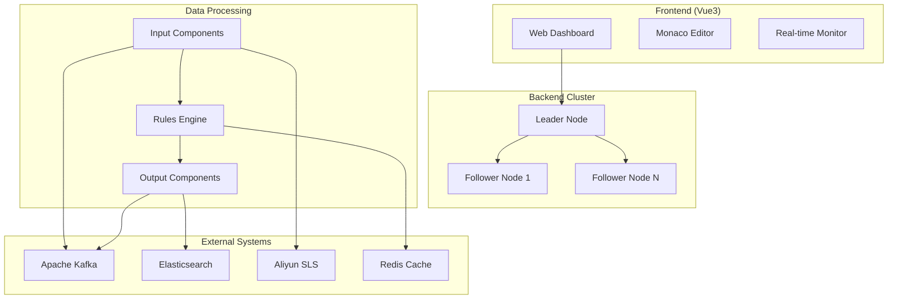

# 🚀 AgentSmith-HUB

> **An SDPP (Security Data Pipeline Platform) with a Powerful Integrated Security Rule Engine**

AgentSmith-HUB is a next-generation security platform designed for real-time threat detection, advanced alert processing, and flexible data pipeline management. It combines a high-performance stream processing engine with an intuitive web interface, empowering security teams to build and manage sophisticated detection and response workflows at enterprise scale.

## ✨ Key Features

### 🛡️ **Core Platform**
- **Security Data Pipeline** - Ingest, parse, enrich, and route security data from any source (e.g., Kafka, Syslog, APIs).
- **High-Performance Rule Engine** - Build complex detection logic with a powerful XML-based ruleset and custom Go plugins.
- **Real-time Processing** - Detect and respond to threats as they happen with a low-latency, concurrent Go backend.

### 🌐 **Web Management Interface**
- **Modern Vue3 Dashboard** - Intuitive management for all components (inputs, outputs, rulesets, projects).
- **Real-time Monitoring** - Live QPS metrics and system statistics for full operational visibility.
- **Visual Project Builder** - Design and visualize complex data flows connecting all your components.
- **Integrated Code Editor** - Write and test rulesets and plugins directly in the browser with Monaco Editor.

### 🏗️ **Enterprise-Ready Architecture**
- **Cluster Management** - Leader/Follower architecture with auto-failover ensures high availability.
- **Safe Change Management** - A mandatory 3-step workflow (save, apply, restart) for all configuration changes prevents operational disruption.
- **Centralized Logging & Auditing** - Comprehensive error logs and audit trails for compliance and troubleshooting.

### 🔄 **Stream Processing Engine**
- **Multi-source Data Ingestion** - Kafka, Aliyun SLS, extensible plugins
- **Real-time Rule Processing** - Complex event detection and filtering
- **Flexible Output Routing** - Elasticsearch, Kafka, SLS, custom outputs
- **High-performance Architecture** - Go-based backend with concurrent processing

### 📊 **Monitoring & Analytics**
- **Real-time Metrics** - Message processing rates and system performance
- **Cluster Status** - Node health monitoring and resource usage
- **Historical Analytics** - Trending and capacity planning
- **Alert Management** - Proactive issue detection

## 🏛️ Architecture Overview



## 🚀 Quick Start

### Prerequisites

- **Go 1.21+** - Backend runtime
- **Node.js 18+** - Frontend development  
- **Redis** - Caching (optional)
- **Kafka/Elasticsearch** - Data sources/sinks (optional)

### 1. Clone & Build

```bash
# Clone repository
git clone https://github.com/your-org/AgentSmith-HUB.git
cd AgentSmith-HUB

# Build backend
cd src && go build -o agentsmith-hub

# Build frontend  
cd ../web && npm install && npm run build
```

### 2. Start Leader Node

```bash
# Start as cluster leader
./agentsmith-hub -config_root ./config

# Access web interface
open http://localhost:8080
```

### 3. Add Follower Nodes (Optional)

```bash
# Start as follower
./agentsmith-hub -leader 192.168.1.100:8080
```

## 📱 Web Interface Guide

### Dashboard Overview
- **System Metrics** - CPU, Memory, Goroutines
- **Message Statistics** - Daily/hourly processing rates
- **Project Status** - Running/stopped projects overview
- **Cluster Nodes** - Node health and resource usage

### Component Management
- **📥 Inputs** - Configure data sources (Kafka, SLS)
- **📤 Outputs** - Set up data destinations (ES, Kafka)  
- **📋 Rulesets** - Create XML-based processing rules
- **🔌 Plugins** - Develop Go-based custom logic
- **📁 Projects** - Orchestrate data flows

### Advanced Features
- **Pending Changes** - Review and apply configuration updates
- **Error Logs** - Centralized error tracking and debugging
- **Cluster Status** - Monitor distributed node performance
- **Load Local Components** - Import configurations from filesystem

## ⚙️ Configuration Guide

### Project Configuration (YAML)
```yaml
id: "data_pipeline"
name: "Real-time Data Pipeline"
content: |
  INPUT.kafka_source -> RULESET.fraud_detection
  RULESET.fraud_detection -> OUTPUT.elasticsearch_sink
  RULESET.fraud_detection -> OUTPUT.alert_kafka
```

### Input Configuration (YAML)
```yaml
name: "Kafka Consumer"
type: "kafka"
kafka:
  brokers: ["kafka1:9092", "kafka2:9092"]
  topic: "events"
  group: "processing-group"
  compression: "snappy"
  sasl:
    enable: true
    mechanism: "plain"
    username: "${KAFKA_USER}"
    password: "${KAFKA_PASS}"
```

### Ruleset Configuration (XML)
```xml
<root name="Fraud Detection" type="DETECTION">
  <rule id="high_value_transaction" name="High Value Alert">
    <filter field="event_type">transaction</filter>
    <checklist condition="amount_check AND location_check">
      <node id="amount_check" type="MT" field="amount">10000</node>
      <node id="location_check" type="PLUGIN" field="location">
        is_high_risk_location(location.country, location.city)
      </node>
    </checklist>
    <threshold group_by="user_id" range="1h" count_type="COUNT" local_cache="true">3</threshold>
    <append type="STRING" field="alert_level">HIGH</append>
    <append type="PLUGIN" field="risk_score">
      calculate_risk_score(amount, location, user_history)
    </append>
  </rule>
  <rule id="brute_force_detection" name="Login Brute Force Detection">
    <check type="EQU" field="event_type">login_attempt</check>
    <check type="EQU" field="result">failed</check>
    <threshold group_by="user_id" range="1h" count_type="COUNT" local_cache="true">3</threshold>
    <append field="alert_type">brute_force</append>
    <append field="severity">high</append>
  </rule>
</root>
```

### Output Configuration (YAML)
```yaml
name: "Elasticsearch Sink"
type: "elasticsearch"
elasticsearch:
  hosts: ["http://es1:9200", "http://es2:9200"]
  index: "fraud-alerts"
  batch_size: 1000
  flush_dur: "30s"
  auth:
    username: "${ES_USER}"
    password: "${ES_PASS}"
```

## 🔧 Development

### Backend Development
```bash
cd src

# Run with auto-reload (using air)
go install github.com/cosmtrek/air@latest
air

# Run tests
go test ./...

# Build for production
go build -ldflags="-s -w" -o agentsmith-hub
```

### Frontend Development
```bash
cd web

# Development server with hot reload
npm run dev

# Build for production
npm run build

# Preview production build
npm run preview
```

### Plugin Development
```go
package plugin

// Custom plugin function
func Eval(input string, threshold float64) (bool, error) {
    // Your custom logic here
    value, err := strconv.ParseFloat(input, 64)
    if err != nil {
        return false, err
    }
    
    return value > threshold, nil
}
```

## 📊 Monitoring & Operations

### Health Checks
```bash
# Node health
curl http://localhost:8080/ping

# Cluster status
curl http://localhost:8080/cluster-status

# System metrics
curl http://localhost:8080/system-metrics
```

### Performance Metrics
- **QPS Statistics** - Messages processed per second
- **Resource Usage** - CPU, Memory, Goroutines
- **Error Rates** - Failed processing statistics
- **Latency Metrics** - End-to-end processing times

### Scaling Considerations
- **Horizontal Scaling** - Add follower nodes for increased capacity
- **Vertical Scaling** - Increase memory/CPU for complex rule processing
- **Cache Optimization** - Use Redis for distributed rule state
- **Batch Tuning** - Adjust batch sizes for optimal throughput

## 🔒 Security

### Authentication
- **Token-based API Authentication** - Secure cluster communication
- **Web Interface Security** - Session management and CSRF protection

### Network Security
- **TLS Support** - Encrypted communication between nodes
- **Firewall Configuration** - Recommended port restrictions
- **Secret Management** - Environment variable support for credentials

## 🗺️ Roadmap

- [ ] **GraphQL API** - Advanced query capabilities
- [ ] **Kubernetes Integration** - Cloud-native deployment
- [ ] **Multi-tenant Support** - Isolated workspaces
- [ ] **Advanced Analytics** - Machine learning integration
- [ ] **Stream Processing SQL** - SQL-like query interface

## 🤝 Contributing

We welcome contributions! Please see our [Contributing Guidelines](CONTRIBUTING.md) for details.

### Development Setup
1. Fork the repository
2. Create a feature branch: `git checkout -b feature/amazing-feature`
3. Make your changes and add tests
4. Commit your changes: `git commit -m 'Add amazing feature'`
5. Push to the branch: `git push origin feature/amazing-feature`
6. Open a Pull Request

## 📄 License

This project is licensed under the Apache License 2.0 - see the [LICENSE](LICENSE) file for details.

## 🙏 Acknowledgments

- **Monaco Editor** - Code editing experience
- **Vue.js Ecosystem** - Frontend framework and tools
- **Go Community** - Backend libraries and patterns
- **Apache Kafka** - Stream processing inspiration

---

<div align="center">

**[🌐 Website](https://your-domain.com)** • **[📚 Documentation](https://docs.your-domain.com)** • **[💬 Community](https://discord.gg/your-discord)**

Made with ❤️ by the AgentSmith Team

</div>
