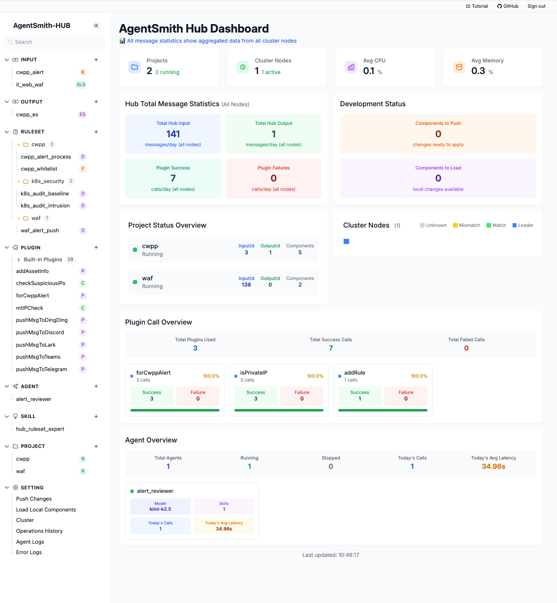
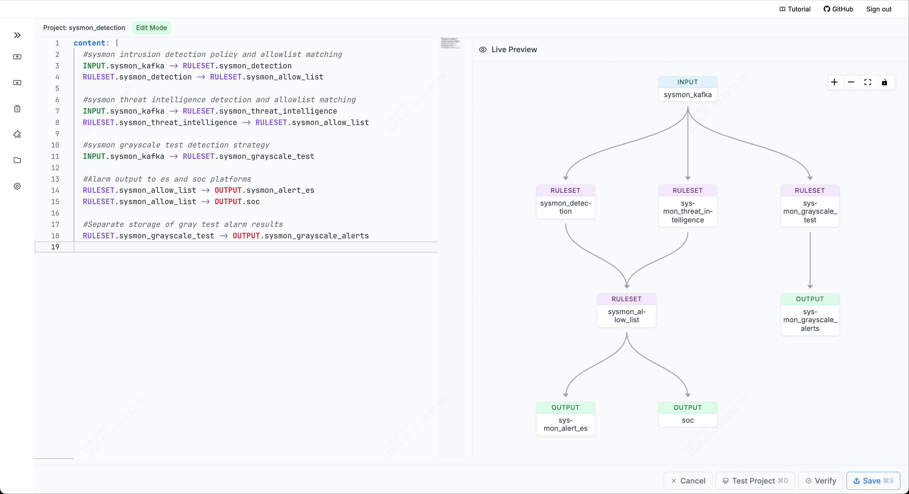
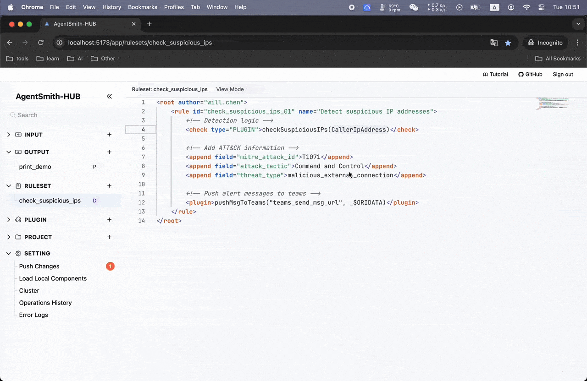
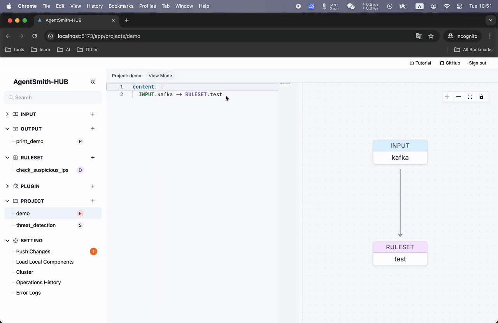
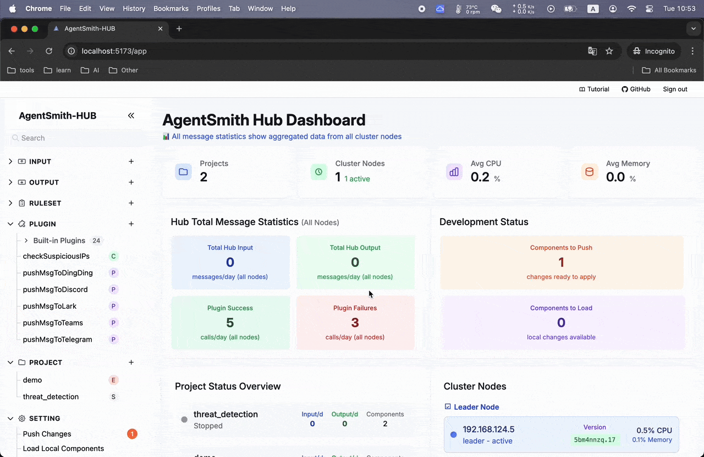
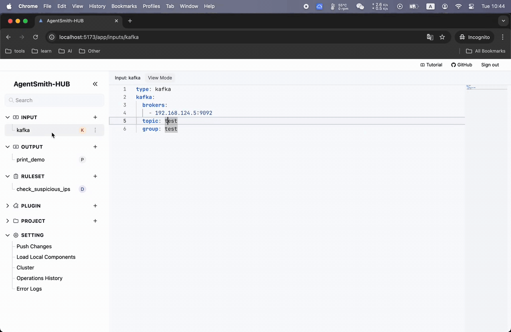
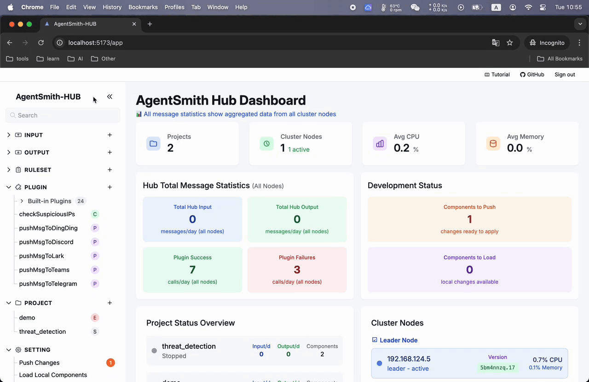
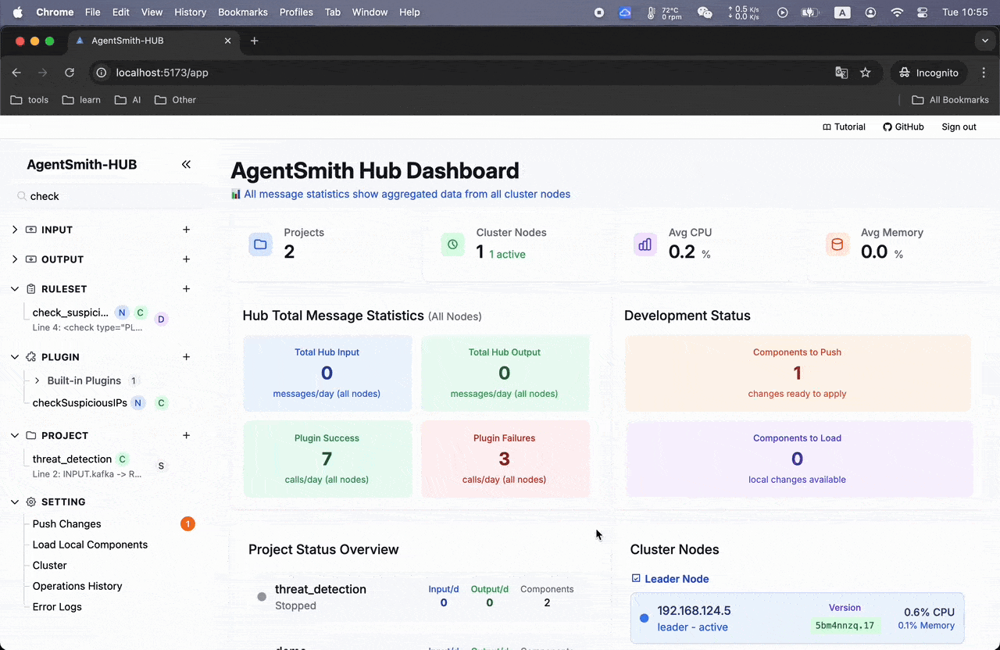

# AgentSmith-HUB

[](https://github.com/EBWi11/AgentSmith-HUB/releases)
[](./LICENSE)


**A high-performance security data pipeline with a real-time rules engine and deeply integrated LLM agents — built for modern SOC and detection engineering teams.**

Process, enrich, detect, and respond at scale — with simple XML-based rules, CEP, rich plugins, and AI-powered analysis wired directly into the stream.



---

## Why AgentSmith-HUB?

If you work in security operations, you probably deal with massive volumes of raw logs and alerts every day. You need to normalize, enrich, correlate, and route them — and ideally detect threats in real time, not in batch jobs. AgentSmith-HUB is built to handle all of this in a single, opinionated platform:

- **High-signal detections, not dashboards** — Design real-time detections and data transformations with simple, readable XML rules instead of ad‑hoc scripts
- **Blazing fast at scale** — 3.90M messages/sec on just 2 vCPUs ([benchmark](docs/performance-testing-report.md)); built to sit directly in front of your SIEM / lake
- **All-in-one pipeline** — Input, normalization, enrichment, correlation, and output in one flow; no more glue scripts between Kafka, ES, ClickHouse, and “rule engines”
- **First-class CEP** — Detect ordered event sequences, absence patterns, and multi-source correlations over time with `<sequence>`, `<threshold>`, `<iterator>`, and `<checklist>`
- **LLM agents in the stream** — Drop LLM-powered agents into the same pipeline for alert triage, enrichment, rule authoring, and auto-whitelisting
- **Skills system** — Attach knowledge bases and operational tools to agents via Skills, with progressive disclosure so prompts stay small and fast
- **Rich plugin ecosystem** — Threat intel (VirusTotal, ThreatBook, Shodan), GeoIP, encoding, regex, time/window helpers, LLM calls, and more
- **Production features out of the box** — Cluster mode, health checks, daily stats, sample data, Push Changes / review workflow, and a modern Web UI for rule and project orchestration

### Who is this for?

- **SOC / CERT / CSIRT teams** that want an opinionated place to run detections, triage alerts, and reduce false positives without building their own engine from scratch.
- **Detection engineers / threat hunters** who care about CEP, thresholds, and precise control over when an alert fires (and when it must not).
- **Security platform / data teams** who already own Kafka / ES / ClickHouse and want a thin, fast, open platform to orchestrate security data flows and LLM-powered analysis.

## How It Works

AgentSmith-HUB uses a straightforward pipeline model:

```
INPUT (Kafka / SLS / ...) → RULESET / AGENT → RULESET / AGENT → OUTPUT (Kafka / ES / ClickHouse / SLS / ...)
```

Rulesets and agents can be freely chained within a **Project**, giving you full control over data flow and allowing you to mix “hard” rules with “soft” LLM judgement in the same stream:



### Core Components at a Glance

- **INPUT**: Connects to streaming sources like **Kafka**, Aliyun **SLS**, and cloud-managed Kafka variants; supports Grok parsing and JSON so you normalize once and reuse everywhere.
- **RULESET**: XML-based real-time rules engine with checks, checklists, thresholds (count / SUM / CLASSIFY), CEP sequences, iterators, and data append/modify/del — all executed strictly in the order you write them.
- **AGENT**: LLM-powered node that runs in the same pipeline as rulesets; for each event it can call an LLM (with tools and skills) to score, enrich, or auto-generate rules/whitelists, then forward the enriched event downstream.
- **OUTPUT**: Sends processed data to **Kafka**, **Elasticsearch** (v7/v8/v9), **ClickHouse**, or simple print, with batching, time-based flush, TLS/auth, and idempotent Kafka producers for safe delivery.
- **SKILL**: Reusable capability module for agents — knowledge skills provide on‑demand reference content, builtin skills expose Go-implemented tools like `hub_ruleset_editor` for ruleset CRUD.
- **PLUGIN**: Extensible function system powering checks, enrichment, and actions: GeoIP, URL parsing, encoding, time window helpers, threat intelligence lookups, single-shot LLM calls, and more — all composable directly in rules.

### Web UI & API Highlights

- **Visual rule and project editing**: Rich browser UI for editing rulesets with syntax help, validation, and GIF-level feedback; drag-style project orchestration to define `INPUT → RULESET / AGENT → OUTPUT` flows.
- **One-click testing everywhere**: Built-in test runners for **Output**, **Ruleset**, **Plugin**, **Agent**, and **Project** components (including sample data capture), so you can validate changes before they hit real outputs.
- **Operations, errors, and cluster view**: Dedicated views for error logs, operations history (project start/stop/restart, config changes, agent tool calls), and basic cluster status so you can see what is running where.
- **Safe change management**: All edits go through temporary configs, diff & review, and then **Push Changes** to apply — the platform automatically figures out affected projects and restarts them safely.
- **HTTP API for automation**: JSON APIs mirror the UI capabilities (component CRUD, project lifecycle, testing), so you can integrate AgentSmith-HUB into CI/CD, internal portals, or automation scripts.

### Rules Engine in 60 Seconds

At the heart of AgentSmith-HUB is a streaming rules engine designed for security detections:

- **Checks & checklists**: Match on strings, numbers, regex, and plugins; combine conditions with AND/OR/NOT using logical expressions.
- **Thresholds & windows**: Detect frequency, sums, or distinct counts over sliding time windows (e.g. brute-force, spray, exfil).
- **CEP sequences**: Express ordered multi-event patterns and absence (e.g. `login -> !mfa`, `recon -> exploit -> exfil`) with `<sequence>`.
- **Data shaping**: Enrich, modify, or delete fields in place, and call plugins to pull in external context or compute derived fields.

A minimal example that enriches with threat intel and then detects on the enriched field:

```xml
<rule id="enrich_and_detect" name="Enrich with TI then alert">
    <append type="PLUGIN" field="threat_info">threatbook(src_ip)</append>
    <check type="EQU" field="threat_info.severity">high</check>
    <append field="alert_level">critical</append>
</rule>
```

For the full syntax (all operations, modes, and best practices), see the [Complete Guide](docs/agentsmith-hub-guide.md).

### LLM Agents & Skills

Agents are LLM-powered components that sit in the pipeline alongside rulesets. They receive event batches, call an LLM with tool-use support, and forward enriched results downstream.

```yaml
# Agent: AI-powered alert triage
model: gpt-4o-mini
system_prompt: |
  For each alert, add llm_confidence (0-1) and llm_analysis fields.
skills:
  - hub_ruleset_expert    # Knowledge skill: rules engine reference
tools: all                # Expose all plugins as LLM tools
batch:
  size: 5
  timeout: 30s
```

**Skills** provide modular capabilities to agents:
- **Knowledge skills** — Reference docs loaded on-demand (progressive disclosure)
- **Builtin skills** — Go-implemented tools (e.g., `hub_ruleset_editor` for reading/writing rulesets)

Use agents in your project like any other component:

```yaml
content: |
  INPUT.kafka_alerts -> AGENT.alert_reviewer
  AGENT.alert_reviewer -> OUTPUT.enriched_alerts
```

## Built-in Detection Rulesets

AgentSmith-HUB ships with production-ready detection rulesets that you can deploy immediately — no rule-writing required. All rules are mapped to [MITRE ATT&CK](https://attack.mitre.org/) for seamless integration with your security workflows.

### Kubernetes Audit Log Security

Two rulesets covering **25 detection rules** for Kubernetes audit logs, designed with multi-condition correlation and system-controller exclusion to minimize false positives.

<details>
<summary><b>k8s_audit_baseline</b> — Workload & RBAC Security Baseline (11 rules)</summary>

Detects Kubernetes configurations that violate security best practices at the point of creation or modification.

| Rule | Detection | Severity | MITRE ATT&CK |
|------|-----------|----------|---------------|
| B001–B003 | **Privileged containers** — Pod, Deployment, DaemonSet with `privileged: true` | HIGH | T1611 Privilege Escalation |
| B004–B005 | **Host namespace sharing** — `hostNetwork` / `hostPID` / `hostIPC` breaks container isolation | HIGH | T1611 Privilege Escalation |
| B006, B011 | **Container runtime socket mount** — `docker.sock` / `containerd.sock` enables container escape | HIGH | T1611 Privilege Escalation |
| B007 | **Sensitive hostPath mount** — mounting `/`, `/etc`, `/proc`, `/sys`, `/root` | HIGH | T1611 Privilege Escalation |
| B008 | **CAP_SYS_ADMIN capability** — near-equivalent to full privileged mode | HIGH | T1611 Privilege Escalation |
| B009 | **Wildcard ClusterRole** — `resources: ["*"]` or `verbs: ["*"]` grants unrestricted access | HIGH | T1098.001 Persistence |
| B010 | **cluster-admin binding** — any subject bound to cluster-admin = full cluster compromise | HIGH | T1098.001 Persistence |

</details>

<details>
<summary><b>k8s_audit_intrusion</b> — Active Intrusion Detection (14 rules)</summary>

Detects highly suspicious operations that indicate active intrusion, lateral movement, or post-exploitation activity.

| Rule | Detection | Severity | MITRE ATT&CK |
|------|-----------|----------|---------------|
| I001 | **Exec into kube-system pod** — non-system user shell access to critical pods | HIGH | T1609 Execution |
| I002 | **Cluster-wide secrets enumeration** — listing secrets across all namespaces | HIGH | T1552.007 Credential Access |
| I003 | **Anonymous RBAC binding** — granting roles to `system:anonymous` | HIGH | T1098 Persistence |
| I004 | **Admission webhook tampering** — mutating webhook can intercept all resource creation | HIGH | T1546 Persistence |
| I005 | **External workload in kube-system** — non-system user deploying to kube-system | HIGH | T1610 Persistence |
| I006 | **Validating webhook deletion** — disabling OPA/Gatekeeper/Kyverno policy enforcement | HIGH | T1562.001 Defense Evasion |
| I007 | **Node proxy access** — direct kubelet API access bypassing RBAC | HIGH | T1599 Lateral Movement |
| I008 | **User impersonation** — assuming another identity via impersonation headers | HIGH | T1134.001 Privilege Escalation |
| I009 | **kube-system secret/configmap deletion** — disrupting cluster operations | MEDIUM | T1485 Impact |
| I010 | **Excessive secret access** — 20+ distinct secrets read in 5 min *(threshold)* | MEDIUM | T1552.007 Credential Access |
| I011 | **Exec shell spray** — exec into 10+ different pods in 3 min *(threshold)* | HIGH | T1609 Lateral Movement |
| I012 | **Privileged SA token theft** — creating tokens for kube-system service accounts | HIGH | T1528 Credential Access |
| I013 | **CronJob with reverse shell** — bash reverse shells, nc, base64 obfuscation, attack tools | HIGH | T1053.007 Execution |
| I014 | **Attack tool / crypto-miner images** — kali, metasploit, xmrig, cobaltstrike, etc. | HIGH | T1610 Execution |

</details>

> **Quick start:** Import the built-in rulesets from `config/ruleset/` (`k8s_audit_baseline.xml` and `k8s_audit_intrusion.xml`), connect your K8s audit log source, and you have production-grade Kubernetes threat detection running in minutes — no tuning needed.

### Built-in K8s Ruleset Files

AgentSmith-HUB includes Kubernetes security rulesets out of the box. You can use them directly without writing custom XML first:

- `config/ruleset/k8s_audit_baseline.xml`
- `config/ruleset/k8s_audit_intrusion.xml`

Recommended onboarding flow:

1. Import both built-in rulesets.
2. Route Kubernetes audit logs to these rulesets in your Project.
3. Verify detections in test mode with real sample events.
4. Tune thresholds (if needed) for your cluster's normal behavior.

More built-in rulesets for additional data sources are on the roadmap. Contributions are welcome!

## Features at a Glance

<table>
<tr>
<td width="50%">

**Rule Editing**


</td>
<td width="50%">

**Rule Testing**



</td>
</tr>
<tr>
<td>

**Project Orchestration**



</td>
<td>

**Plugin Testing**



</td>
</tr>
<tr>
<td>

**Input Connection Check**



</td>
<td>

**Search**



</td>
</tr>
<tr>
<td>

**Error Logs & Operations History**



</td>
</tr>
</table>

## Deployment

1. Download and extract the release archive to `/opt/agentsmith-hub`
2. Copy the config folder: `cp -r /opt/agentsmith-hub/config /opt/hub_config`
3. Configure Redis in `/opt/hub_config/config.yaml`
4. Start the service:
   ```bash
   # Leader mode (default)
   ./start.sh

   # Follower mode (uses the same Redis as leader)
   ./start.sh --follower

   # See all options
   ./start.sh --help
   ```
5. Access token is generated at `/etc/hub/.token` on first run
6. Install and configure Nginx:
   ```bash
   sudo cp /opt/agentsmith-hub/nginx/nginx.conf /etc/nginx/
   sudo nginx -s reload
   ```
7. Open `http://your-host` in your browser (port 80)

## Documentation

- [Complete Guide](docs/agentsmith-hub-guide.md) | [Guide (Chinese)](docs/agentsmith-hub-guide-zh.md)
- [Performance Testing Report](docs/performance-testing-report.md)

## License

AgentSmith-HUB is licensed under the [Apache License 2.0](./LICENSE) with the Commons Clause restriction.

You are free to use, modify, and deploy this software — the restriction only prevents selling the software itself as a commercial product or service. Internal enterprise use is fully permitted.
