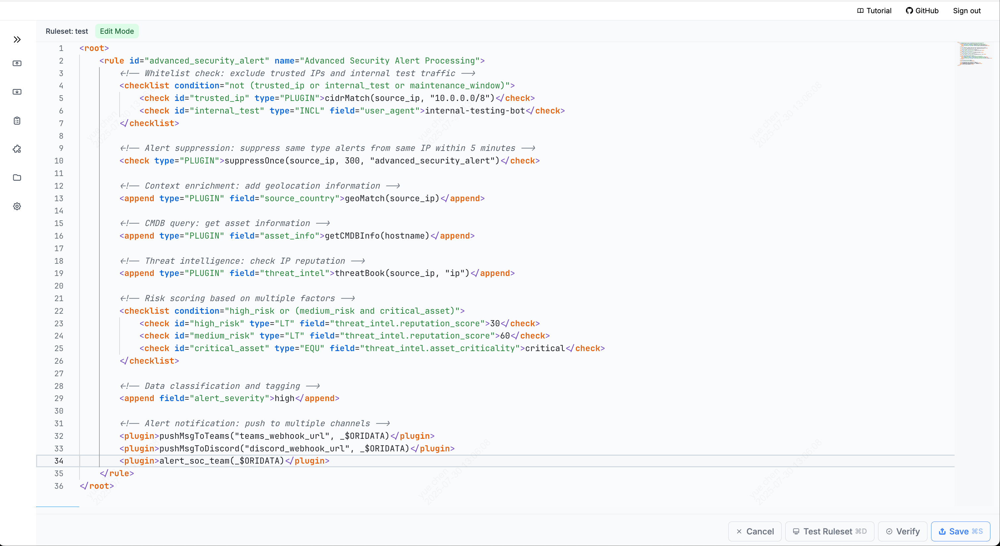
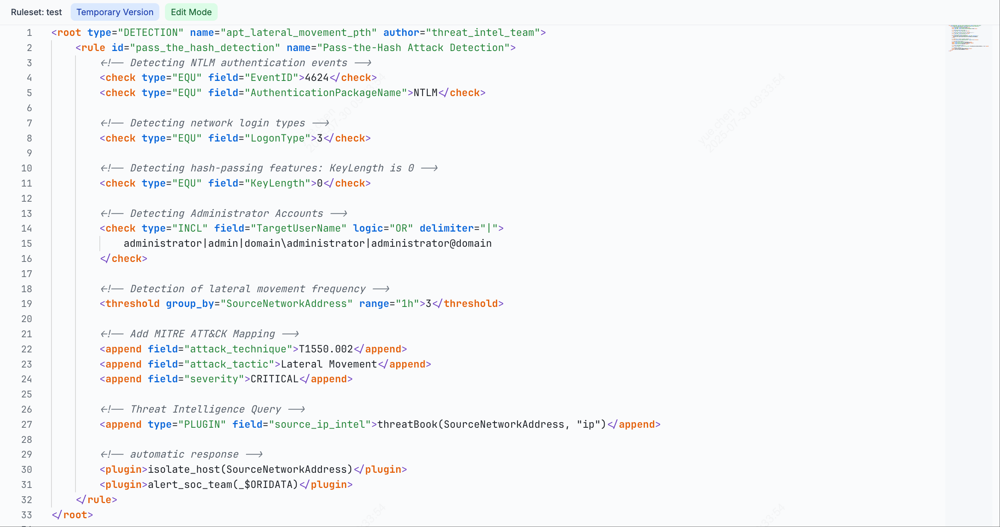
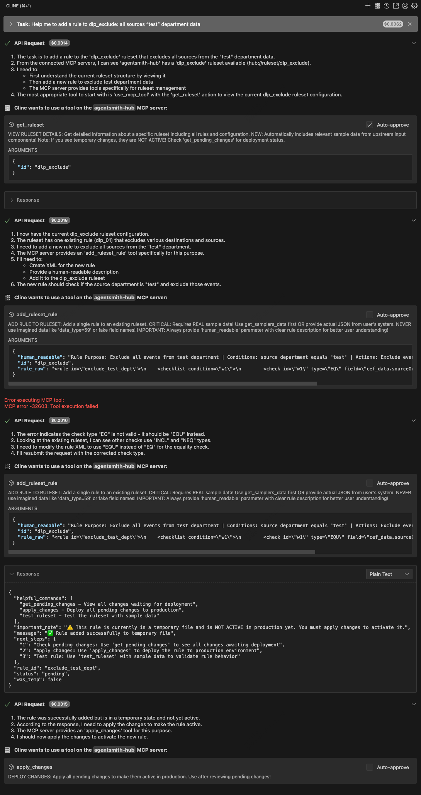

# AgentSmith-HUB

[](https://github.com/EBWi11/AgentSmith-HUB/releases)
[](./LICENSE)


**A high-performance security data pipeline platform with a built-in real-time rules engine.**

Process, enrich, detect, and respond — all in one place, with simple XML-based rules.


---

## Why AgentSmith-HUB?

If you work in security operations, you probably deal with massive volumes of raw logs and alerts every day. You need to normalize, enrich, correlate, and route them — and ideally detect threats in real time. AgentSmith-HUB is built to handle all of this in a single platform:

- **No coding required** — Write detection and processing logic in simple, readable XML rules
- **Blazing fast** — 40,000+ messages/sec on just 2 vCPUs ([benchmark](docs/performance-testing-report.md))
- **All-in-one pipeline** — Input, detection, enrichment, transformation, and output in a unified flow
- **CEP built-in** — Detect ordered event sequences, absence patterns, and multi-source correlations over time
- **Scale horizontally** — Built-in cluster mode with leader/follower architecture
- **Rich plugin ecosystem** — Threat intel (VirusTotal, ThreatBook, Shodan), GeoIP, encoding, regex, and more
- **Modern Web UI** — Visual rule editing, project orchestration, real-time testing, and log search
- **MCP support** — Integrate with AI-powered tools for intelligent rule management

## How It Works

AgentSmith-HUB uses a straightforward pipeline model:

```
INPUT (Kafka / SLS / ...) → RULESET (detect & transform) → OUTPUT (Kafka / ES / ClickHouse / SLS / ...)
```

Multiple rulesets can be chained together within a **Project**, giving you full control over data flow:


### Rules Engine Syntax

The rules engine uses seven intuitive XML elements:

| Element | Purpose | Example |
|---------|---------|---------|
| `<check>` | Detection — regex, string match, numeric comparison, plugin | `<check type="REGEX" field="src_ip">^10\..*</check>` |
| `<checklist>` | Logical combination of checks (AND / OR / NOT) | `<checklist condition="a and (b or c)">` |
| `<threshold>` | Frequency-based detection with time windows | Detect brute-force: 5 failures in 60s |
| `<sequence>` | CEP — detect ordered event patterns across time | `login -> !mfa` (login without MFA) |
| `<append>` | Enrich or modify data fields | `<append type="PLUGIN" field="geo">geoMatch(src_ip)</append>` |
| `<del>` | Remove fields from data | `<del>sensitive_field</del>` |
| `<plugin>` | Call external APIs or custom logic | Threat intel lookup, enrichment, etc. |

Rules execute **in the order you write them**, so you can freely combine detection and transformation:

```xml
<rule id="enrich_and_detect">
    <!-- First, enrich with threat intelligence -->
    <append type="PLUGIN" field="threat_info">threatbook(src_ip)</append>
    <!-- Then, detect based on enriched data -->
    <check type="EQU" field="threat_info.severity">high</check>
    <!-- Finally, add metadata -->
    <append field="alert_level">critical</append>
</rule>
```

Detect **event sequences** across time with CEP:

```xml
<rule id="login_no_mfa" name="Login without MFA">
    <sequence within="2m" group_by="user_id">
        <event id="login">
            <check type="EQU" field="event_type">login</check>
        </event>
        <event id="mfa">
            <check type="EQU" field="event_type">mfa_verify</check>
        </event>
        <condition>login -> !mfa</condition>
    </sequence>
</rule>
```




## Features at a Glance

<table>
<tr>
<td width="50%">

**Rule Editing**


</td>
<td width="50%">

**Rule Testing**


</td>
</tr>
<tr>
<td>

**Project Orchestration**


</td>
<td>

**Plugin Testing**


</td>
</tr>
<tr>
<td>

**Input Connection Check**


</td>
<td>

**Search**


</td>
</tr>
<tr>
<td>

**Error Logs & Operations History**


</td>
<td>

**MCP Integration**



</td>
</tr>
</table>

## Deployment

1. Download and extract the release archive to `/opt/agentsmith-hub`
2. Copy the config folder: `cp -r /opt/agentsmith-hub/config /opt/`
3. Configure Redis in `/opt/hub_config/config.yaml`
4. Start the service:
   ```bash
   # Leader mode (default)
   ./start.sh

   # Follower mode (uses the same Redis as leader)
   ./start.sh --follower

   # See all options
   ./start.sh --help
   ```
5. Access token is generated at `/etc/hub/.token` on first run
6. Install and configure Nginx:
   ```bash
   sudo cp /opt/agentsmith-hub/nginx/nginx.conf /etc/nginx/
   sudo nginx -s reload
   ```
7. Open `http://your-host` in your browser (port 80)

### Kubernetes

K8s deployment manifests are available in the [`k8s/`](./k8s) directory.

## Documentation

- [Complete Guide](docs/agentsmith-hub-guide.md) | [Guide (Chinese)](docs/agentsmith-hub-guide-zh.md)
- [CEP Sequence Design](docs/cep-sequence-design.md)
- [Performance Testing Report](docs/performance-testing-report.md)

## License

AgentSmith-HUB is licensed under the [Apache License 2.0](./LICENSE) with the Commons Clause restriction.

You are free to use, modify, and deploy this software — the restriction only prevents selling the software itself as a commercial product or service. Internal enterprise use is fully permitted.
