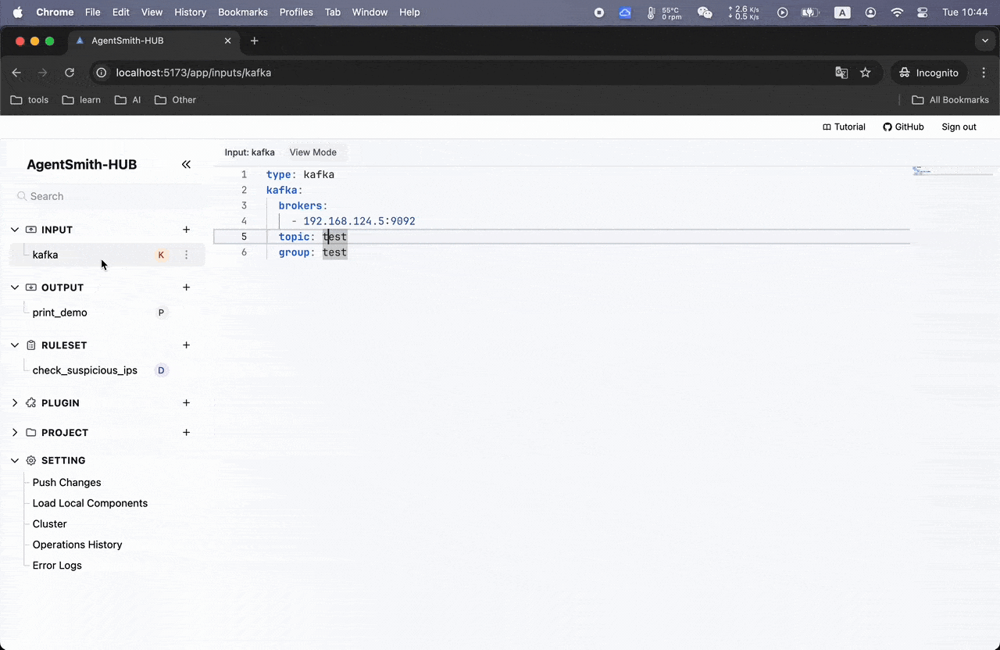

# AgentSmith-HUB

> **Enterprise Security Data Pipeline Platform (SDPP) with Integrated Real-Time Threat Detection Engine**

AgentSmith-HUB is a **Security Data Pipeline Platform** designed to provide comprehensive security data processing, real-time threat detection, and automated incident response capabilities. It enables security teams to build, deploy, and manage sophisticated detection and response workflows at enterprise scale.

## Guide
[agentsmith-hub-guide.md](docs/agentsmith-hub-guide.md)

## Function Show
* InputEdit&ConnectCheck

* RuleEdit

* RuleTest

* ProjectEdit

* PluginTest

* Search

* Errlog&Operations

* MCP

## Deployment Tutorial

1. unzip and tar -xf AgentSmith-HUB, And make sure the hub folder is under /opt/: `/opt/agentsmith-hub`
2. Copy hub config folder to /opt/, `cp -r /opt/agentsmith-hub/config/ /opt/`
3. Install redis and configure it in `/opt/hub_config/config.yaml`
4. Run start.sh or stop.sh under the hub to start or stop the hub backend service, like: `nohup ./start.sh &`, The start.sh default mode is Leader, `start.sh --follower` will run in follower mode. In this mode, config.yaml needs to be consistent with Leader (that is, use the same Redis instance); For more information, see --help.
5. The first time you run the backend, a token will be created, located in `/etc/hub/.token`
6. The backend logs are located in `/var/log/hub_logs/`
7. Install Nginx, and `sudo cp /opt/agentsmith-hub/nginx/nginx.conf /etc/nginx/`(This will overwrite your previous nginx.conf. Please back it up in advance if necessary), and run `sudo nginx -t reload`, the frontend will work on port 80 and a token is required for access.

## License

AgentSmith-HUB is licensed under the Apache License 2.0 with the Commons Clause restriction. This means:

- You are free to use, modify, and distribute the software for personal or non-commercial purposes.
- Commercial use, including direct or indirect integration into commercial products or services, is strictly prohibited.

For more details, see the [LICENSE](./LICENSE) file.

