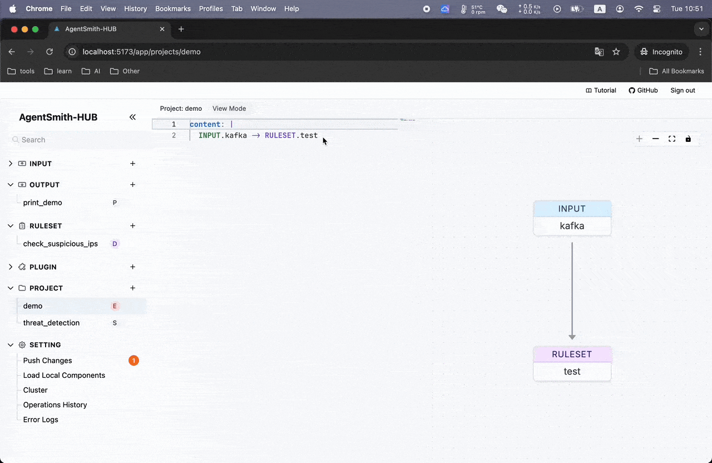
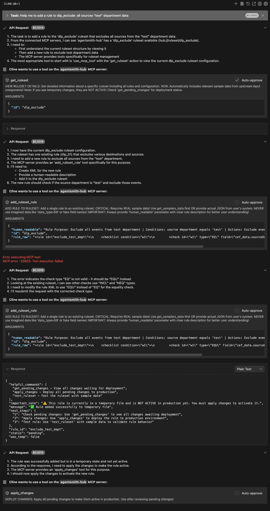

# AgentSmith-HUB

> **Enterprise Security Data Pipeline Platform (SDPP) with Integrated Real-Time Threat Detection Engine**

AgentSmith-HUB is a **Security Data Pipeline Platform** designed to provide comprehensive security data processing, real-time threat detection, and automated incident response capabilities. It enables security teams to build, deploy, and manage sophisticated detection and response workflows at enterprise scale.

If you have a lot of raw logs, security alarms that need to be processed, enriched, and linked with other systems, then the HUB will be your best tool to help you get the job done efficiently, standardized, and with very low learning costs.

If you have an intrusion detection scenario, then the HUB can also support complex intrusion detection syntax, and the HUB has extremely high performance, which can easily and efficiently handle large amounts of data. And the HUB supports cluster mode, so you can easily expand capacity.

From this, we can see that HUB's Ruleset syntax is actually very simple, using the following combinations for detection and data operations:
* **\<check\>**: Used for detection, supporting common operations like regex matching, string matching, numeric comparisons, custom plugins, etc.
* **\<checklist\>**: Used for detection, supporting logical operator combinations of <check> with and, or, not, and parentheses.
* **\<threshold\>**: Used for detection, supporting frequency statistics and threshold judgment of data.
* **\<append\>**: Used for data operations, supporting data appending, modification, and other operations, with support for custom plugins.
* **\<del\>**: Used for data operations, for deleting data.
* **\<plugin\>**: Calls custom plugins, commonly used for calling external APIs and other operations.

The execution order of the rules engine follows the order written by the user, for example:
* First use **\<append\>** to append threat intelligence data to the original data, then use **\<check\>** to evaluate the threat intelligence content;
* First use **\<check\>** to detect the original data, and after passing, use **\<append\>** to enrich the data.

In summary, HUB provides simple and flexible syntax that can well support various security scenarios for detection, data processing, alert handling, and other requirements.

 

The HUB not only has a powerful rules engine and plug-in mechanism, but also has a very flexible data orchestration mechanism, which can easily meet various needs in the workplace.

### Function Show
Input Connect Check

Rule Edit

Rule Test

Project Edit

Plugin Test

Search

Errlog & Operations

MCP

### Guide
[Agentsmith-HUB Guide](docs/agentsmith-hub-guide.md)

### Performance Testing Report
[Performance Testing Report](docs/performance-testing-report.md)

### Deployment Tutorial

1. unzip and tar -xf AgentSmith-HUB, And make sure the hub folder is under /opt/: `/opt/agentsmith-hub`
2. Copy hub config folder to /opt/, `cp -r /opt/agentsmith-hub/config /opt/`
3. Install redis and configure it in `/opt/hub_config/config.yaml`
4. Run start.sh or stop.sh under the hub to start or stop the hub backend service, like: `./start.sh`, The start.sh default mode is Leader, `./start.sh --follower` will run in follower mode. In this mode, config.yaml needs to be consistent with Leader (that is, use the same Redis instance); For more information, see `./start.sh --help`.
5. The first time you run the backend, a token will be created, located in `/etc/hub/.token`
6. The backend logs are located in `/var/log/hub_logs/`
7. Install Nginx, and `sudo cp /opt/agentsmith-hub/nginx/nginx.conf /etc/nginx/`(This will overwrite your previous nginx.conf. Please back it up in advance if necessary), and run `sudo nginx -t reload`, the frontend will work on port 80 and a token is required for access.

### License

AgentSmith-HUB is licensed under the Apache License 2.0 with the Commons Clause restriction. This means:

- You are free to use, modify, and distribute the software for personal or non-commercial purposes.
- Commercial use, including direct or indirect integration into commercial products or services, is strictly prohibited.

For more details, see the [LICENSE](./LICENSE) file.

