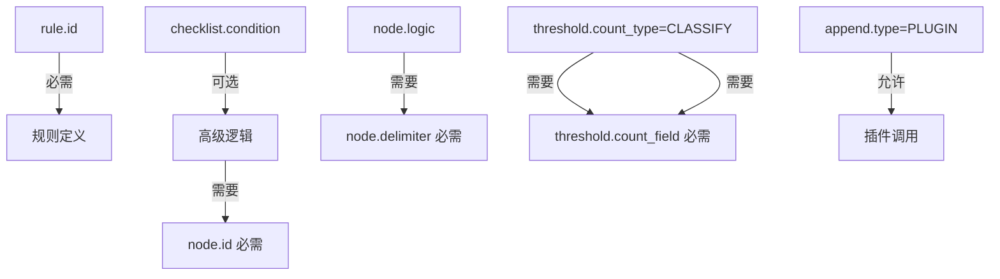

# ��️ AgentSmith-HUB 规则引擎完整指南

## 📚 目录
1. [引擎架构深度解析](#引擎架构深度解析)
2. [循序渐进学习路径](#循序渐进学习路径)
3. [基础语法精通](#基础语法精通)
4. [高级特性详解](#高级特性详解)
5. [性能优化指南](#性能优化指南)
6. [实战案例集](#实战案例集)
7. [问题诊断手册](#问题诊断手册)

---

## 🏗️ 引擎架构深度解析

### 核心设计理念
AgentSmith-HUB规则引擎采用**三层验证架构**，确保规则的正确性和性能：

```
数据流 → 规则引擎 → 验证结果
  ↓         ↓         ↓
输入数据   三层验证   输出结果
```

### 三层验证架构
| 验证层 | 功能描述 | 验证内容 |
|--------|----------|----------|
| **Verify** | XML语法验证 | 基础XML结构、标签闭合、属性格式 |
| **ValidateWithDetails** | 结构化验证 | 元素完整性、属性依赖、行号错误定位 |
| **RulesetBuild** | 语义验证 | 插件存在性、内存分配、性能优化 |

### 性能优化机制
引擎内置多项自动优化：
- **自动节点排序**：按性能分层执行（ISNULL/NOTNULL → 字符串操作 → REGEX → PLUGIN）
- **智能缓存**：字段路径缓存、规则执行缓存、ristretto本地缓存
- **内存管理**：64MB缓存限制、1000万计数器、深拷贝保护

---

## 🎯 循序渐进学习路径

### 第一阶段：基础规则（5分钟入门）

#### 1.1 最简单的规则
```xml
<root type="DETECTION" author="新手">
    <rule id="my_first_rule" name="我的第一个规则">
        <checklist>
            <node type="INCL" field="process_name">notepad.exe</node>
        </checklist>
    </rule>
</root>
```

**解读**：当进程名包含"notepad.exe"时触发规则。

#### 1.2 添加过滤器优化性能
```xml
<root type="DETECTION" author="新手">
    <rule id="filtered_rule" name="带过滤器的规则">
        <filter field="event_type">process_creation</filter>
        <checklist>
            <node type="INCL" field="process_name">notepad.exe</node>
        </checklist>
        <append field="alert_level">LOW</append>
    </rule>
</root>
```

**解读**：只处理进程创建事件，提高性能；匹配时添加告警级别字段。

### 第二阶段：逻辑组合（15分钟进阶）

#### 2.1 简单AND逻辑（默认）
```xml
<rule id="and_logic_rule" name="AND逻辑示例">
    <filter field="event_type">file_operation</filter>
    <checklist>
        <node type="INCL" field="file_path">C:\Windows\System32</node>
        <node type="END" field="file_name">.exe</node>
        <node type="NEQ" field="operation">read</node>
    </checklist>
    <append field="risk_level">MEDIUM</append>
</rule>
```

**解读**：文件路径包含System32 **AND** 文件名以.exe结尾 **AND** 操作不是读取。

#### 2.2 复杂逻辑表达式
```xml
<rule id="complex_logic_rule" name="复杂逻辑示例">
    <filter field="event_type">network_connection</filter>
    <checklist condition="(suspicious_port or known_malware_port) and external_ip and not whitelisted_process">
        <node id="suspicious_port" type="INCL" field="dest_port" logic="OR" delimiter="|">4444|5555|6666</node>
        <node id="known_malware_port" type="EQU" field="dest_port">8080</node>
        <node id="external_ip" type="NSTART" field="dest_ip">192.168</node>
        <node id="whitelisted_process" type="INCL" field="process_name" logic="OR" delimiter="|">chrome.exe|firefox.exe</node>
    </checklist>
    <append field="threat_type">suspicious_network</append>
</rule>
```

**解读**：(可疑端口或已知恶意端口) **AND** 外部IP **AND NOT** 白名单进程。

### 第三阶段：动态数据引用（30分钟精通）

#### 3.1 FromRawSymbol基础用法
```xml
<rule id="dynamic_values_rule" name="动态值引用">
    <filter field="event_category">_$expected_category</filter>
    <checklist>
        <node type="EQU" field="actual_status">_$expected_status</node>
        <node type="MT" field="risk_score">_$threshold_value</node>
    </checklist>
    <append field="processed_time">_$event_timestamp</append>
    <append field="user_department">_$user.profile.department</append>
</rule>
```

**解读**：
- 过滤器值从数据的`expected_category`字段获取
- 节点值从`expected_status`和`threshold_value`字段获取  
- 支持嵌套字段访问：`user.profile.department`

#### 3.2 FromRawSymbol高级嵌套
```xml
<rule id="nested_field_rule" name="嵌套字段访问">
    <filter field="event.source.system">production</filter>
    <checklist>
        <node type="EQU" field="event.metadata.severity">_$alert.config.min_severity</node>
        <node type="INCL" field="user.profile.permissions">_$security.required_permission</node>
    </checklist>
    <threshold group_by="_$grouping.primary_field,_$grouping.secondary_field" range="300s">5</threshold>
    <append field="analysis_context">_$event.metadata.analysis.context</append>
</rule>
```

**解读**：支持深度嵌套字段访问，甚至在threshold的group_by中使用动态字段。

### 第四阶段：频率阈值检测（45分钟掌握）

#### 4.1 默认计数模式
```xml
<rule id="threshold_default" name="默认计数阈值">
    <filter field="event_type">login_failure</filter>
    <checklist>
        <node type="EQU" field="result">failed</node>
    </checklist>
    <threshold group_by="source_ip,username" range="300s" local_cache="true">5</threshold>
    <append field="threshold_type">default_count</append>
</rule>
```

**解读**：5分钟内相同IP和用户名失败登录超过5次触发（简单计数）。

#### 4.2 SUM聚合模式
```xml
<rule id="threshold_sum" name="SUM聚合阈值">
    <filter field="event_type">financial_transaction</filter>
    <checklist>
        <node type="EQU" field="transaction_type">withdrawal</node>
    </checklist>
    <threshold group_by="account_id" range="86400s" count_type="SUM" count_field="amount">50000</threshold>
    <append field="alert_type">large_withdrawal</append>
</rule>
```

**解读**：24小时内同一账户取款总额超过50000触发（数值求和）。

#### 4.3 CLASSIFY唯一值模式
```xml
<rule id="threshold_classify" name="CLASSIFY唯一值阈值">
    <filter field="event_type">resource_access</filter>
    <checklist>
        <node type="EQU" field="access_granted">true</node>
    </checklist>
    <threshold group_by="user_id" range="3600s" count_type="CLASSIFY" count_field="resource_id">25</threshold>
    <append field="alert_type">excessive_resource_access</append>
</rule>
```

**解读**：1小时内同一用户访问超过25个不同资源触发（唯一值计数）。

### 第五阶段：插件集成（60分钟精通）

#### 5.1 插件基础用法
```xml
<rule id="plugin_basic" name="插件基础使用">
    <filter field="event_type">ip_connection</filter>
    <checklist>
        <node type="PLUGIN">is_suspicious_ip(source_ip)</node>
        <node type="NOTNULL" field="payload_size"/>
    </checklist>
    <append type="PLUGIN" field="geo_info">get_geolocation(source_ip)</append>
    <plugin>log_security_event(_$ORIDATA, "suspicious_ip_detected")</plugin>
</rule>
```

**插件返回值类型说明**：
- **checknode插件**：必须返回`bool`类型（如`is_suspicious_ip`）
- **append插件**：可返回任何类型（如`get_geolocation`返回地理信息对象）
- **standalone插件**：返回值被忽略，用于副作用（如`log_security_event`）

#### 5.2 插件高级用法
```xml
<rule id="plugin_advanced" name="插件高级使用">
    <filter field="requires_analysis">true</filter>
    <checklist condition="threat_detected and not false_positive">
        <node id="threat_detected" type="PLUGIN">analyze_threat_patterns(_$ORIDATA)</node>
        <node id="false_positive" type="PLUGIN">is_false_positive(_$event.signature, _$user.trust_level)</node>
    </checklist>
    <append type="PLUGIN" field="threat_intelligence">get_threat_intel(source_ip, domain_name)</append>
    <append type="PLUGIN" field="_$ORIDATA">enrich_security_context(_$ORIDATA)</append>
    <plugin>update_threat_model(_$ORIDATA)</plugin>
    <plugin>escalate_to_soc(_$ORIDATA, "high_confidence")</plugin>
</rule>
```

**高级特性说明**：
- `field="_$ORIDATA"`：完全替换原始数据（插件必须返回`map[string]interface{}`）
- 混合参数类型：字段引用、FromRawSymbol、字面量
- 多个standalone插件：按顺序执行副作用操作

---

## 📖 基础语法精通

### 核心元素层次结构
```
<root>                           # 规则集根元素
├── <rule>                      # 规则定义
    ├── <filter>                # 预过滤器（可选，强烈推荐）
    ├── <checklist>             # 检查逻辑
    │   └── <node>              # 检查节点（可多个）
    ├── <threshold>             # 频率阈值（可选）
    ├── <append>                # 字段追加（可选，可多个）
    ├── <plugin>                # 插件执行（可选，可多个）
    └── <del>                   # 字段删除（可选）
```

### 属性依赖关系图


### 22种节点类型完整清单

#### 字符串匹配类（性能层级：快速）
| 类型 | 功能 | 示例 | 说明 |
|------|------|------|------|
| `EQU` | 完全相等 | `<node type="EQU" field="status">active</node>` | 大小写敏感 |
| `NEQ` | 完全不等 | `<node type="NEQ" field="user">guest</node>` | 大小写敏感 |
| `INCL` | 包含子串 | `<node type="INCL" field="path">/admin/</node>` | 大小写敏感 |
| `NI` | 不包含子串 | `<node type="NI" field="agent">bot</node>` | 大小写敏感 |
| `START` | 开头匹配 | `<node type="START" field="cmd">powershell</node>` | 大小写敏感 |
| `END` | 结尾匹配 | `<node type="END" field="file">.exe</node>` | 大小写敏感 |
| `NSTART` | 开头不匹配 | `<node type="NSTART" field="path">C:\Windows</node>` | 大小写敏感 |
| `NEND` | 结尾不匹配 | `<node type="NEND" field="file">.tmp</node>` | 大小写敏感 |

#### 大小写忽略类（性能层级：快速）
| 类型 | 功能 | 示例 |
|------|------|------|
| `NCS_EQU` | 忽略大小写相等 | `<node type="NCS_EQU" field="browser">CHROME</node>` |
| `NCS_NEQ` | 忽略大小写不等 | `<node type="NCS_NEQ" field="os">windows</node>` |
| `NCS_INCL` | 忽略大小写包含 | `<node type="NCS_INCL" field="domain">SUSPICIOUS</node>` |
| `NCS_NI` | 忽略大小写不包含 | `<node type="NCS_NI" field="referrer">GOOGLE</node>` |
| `NCS_START` | 忽略大小写开头 | `<node type="NCS_START" field="cmd">POWERSHELL</node>` |
| `NCS_END` | 忽略大小写结尾 | `<node type="NCS_END" field="script">.PS1</node>` |
| `NCS_NSTART` | 忽略大小写开头不匹配 | `<node type="NCS_NSTART" field="user">ADMIN</node>` |
| `NCS_NEND` | 忽略大小写结尾不匹配 | `<node type="NCS_NEND" field="domain">TRUSTED</node>` |

#### 数值比较类（性能层级：快速）
| 类型 | 功能 | 示例 |
|------|------|------|
| `MT` | 大于 | `<node type="MT" field="score">75.5</node>` |
| `LT` | 小于 | `<node type="LT" field="cpu_usage">90</node>` |

#### 空值检查类（性能层级：最快）
| 类型 | 功能 | 示例 |
|------|------|------|
| `ISNULL` | 字段为空 | `<node type="ISNULL" field="optional_field"></node>` |
| `NOTNULL` | 字段非空 | `<node type="NOTNULL" field="required_field"></node>` |

#### 正则表达式类（性能层级：慢）
| 类型 | 功能 | 示例 |
|------|------|------|
| `REGEX` | 正则匹配 | `<node type="REGEX" field="ip">^192\.168\.\d+\.\d+$</node>` |

#### 插件调用类（性能层级：最慢）
| 类型 | 功能 | 示例 |
|------|------|------|
| `PLUGIN` | 插件函数 | `<node type="PLUGIN">is_malicious_domain(domain_name)</node>` |

---

## 🚀 高级特性详解

### Threshold阈值机制深度解析

#### 三种计数模式对比
| 模式 | count_type | 缓存前缀 | 内存使用 | 适用场景 |
|------|------------|----------|----------|----------|
| **默认计数** | 空或不设置 | `F_` | 最低 | 事件频率检测 |
| **数值聚合** | `SUM` | `FS_` | 中等 | 数值累加检测 |
| **唯一计数** | `CLASSIFY` | `FC_` | 最高 | 去重统计检测 |

#### 默认计数模式详解
```xml
<rule id="frequency_detection" name="登录失败频率检测">
    <filter field="event_type">authentication</filter>
    <checklist>
        <node type="EQU" field="result">failed</node>
    </checklist>
    <threshold group_by="source_ip,username" range="300s" local_cache="true">5</threshold>
    <!-- 
    实现机制：
    - 缓存键：F_hash(rulesetID+ruleID+source_ip+username)
    - 存储：整数计数器
    - 内存：每个唯一组合约8字节
    -->
</rule>
```

#### SUM聚合模式详解
```xml
<rule id="transaction_sum_detection" name="大额交易聚合检测">
    <filter field="event_type">financial_transaction</filter>
    <checklist>
        <node type="EQU" field="transaction_type">transfer</node>
        <node type="MT" field="amount">1000</node>
    </checklist>
    <threshold group_by="account_id" range="86400s" count_type="SUM" count_field="amount">100000</threshold>
    <!-- 
    实现机制：
    - 缓存键：FS_hash(rulesetID+ruleID+account_id)
    - 存储：累加的amount值
    - 内存：每个账户约16字节
    - 应用：24小时内单账户转账总额超过10万
    -->
</rule>
```

#### CLASSIFY唯一计数模式详解
```xml
<rule id="resource_access_classify" name="资源访问唯一性检测">
    <filter field="event_type">resource_access</filter>
    <checklist>
        <node type="EQU" field="access_granted">true</node>
    </checklist>
    <threshold group_by="user_id" range="3600s" count_type="CLASSIFY" count_field="resource_id">20</threshold>
    <!-- 
    实现机制：
    - 主缓存键：FC_hash(rulesetID+ruleID+user_id)
    - 子缓存键：FC_hash(rulesetID+ruleID+user_id)_hash(resource_id)
    - 存储：主键存储唯一值集合，子键存储个体计数
    - 内存：需要额外的CacheForClassify管理唯一值
    - 应用：1小时内用户访问超过20个不同资源
    -->
</rule>
```

### FromRawSymbol动态字段系统

#### 基础语法
```xml
<!-- 静态值 -->
<node type="EQU" field="status">active</node>

<!-- 动态值：从数据的expected_status字段获取值 -->
<node type="EQU" field="status">_$expected_status</node>

<!-- 嵌套字段：支持深层访问 -->
<node type="EQU" field="level">_$security.alert.level</node>
```

#### 高级嵌套示例
```xml
<rule id="dynamic_complex_rule" name="复杂动态字段示例">
    <!-- 过滤器支持动态值 -->
    <filter field="event.category">_$config.monitoring.target_category</filter>
    
    <checklist condition="severity_check and location_check">
        <!-- 节点值支持动态引用 -->
        <node id="severity_check" type="MT" field="risk_score">_$thresholds.security.min_score</node>
        
        <!-- 多级嵌套字段访问 -->
        <node id="location_check" type="INCL" field="user.location.country">_$policies.allowed_countries</node>
    </checklist>
    
    <!-- 阈值配置支持动态字段 -->
    <threshold group_by="_$grouping.primary_key,_$grouping.secondary_key" 
               range="300s" 
               count_type="SUM" 
               count_field="_$metrics.value_field">100</threshold>
    
    <!-- 字段追加支持动态值 -->
    <append field="processing_timestamp">_$event.metadata.received_time</append>
    <append field="risk_context">_$analysis.context.detailed_info</append>
</rule>
```

#### 性能缓存机制
```
第一次访问：_$event.metadata.timestamp
  ↓
解析字段路径：["event", "metadata", "timestamp"] 
  ↓
执行字段提取：common.GetCheckData(data, fieldList)
  ↓
缓存结果：ruleCache["_$event.metadata.timestamp"] = {data: "2024-01-01T10:00:00Z", exist: true}
  ↓
后续访问：直接从缓存获取
```

### Append字段操作高级技巧

#### 静态字段追加
```xml
<append field="processed_by">agentsmith_hub</append>
<append field="severity_level">HIGH</append>
<append field="detection_timestamp">2024-01-01T10:00:00Z</append>
```

#### 动态字段追加
```xml
<append field="original_process">_$process_name</append>
<append field="user_department">_$user.profile.department</append>
<append field="event_source">_$metadata.source.system</append>
```

#### 插件字段追加
```xml
<append type="PLUGIN" field="geo_location">get_ip_geolocation(source_ip)</append>
<append type="PLUGIN" field="threat_intel">query_threat_database(domain_name, file_hash)</append>
<append type="PLUGIN" field="user_risk_score">calculate_user_risk(_$user_id, _$recent_activities)</append>
```

#### 数据完全替换（高级特性）
```xml
<rule id="data_transformation_rule" name="数据结构转换">
    <filter field="legacy_format">true</filter>
    <checklist>
        <node type="EQU" field="needs_migration">true</node>
        <node type="NOTNULL" field="migration_context"></node>
    </checklist>
    
    <!-- 保存原始信息 -->
    <append field="original_schema_version">_$schema.version</append>
    <append field="migration_timestamp">_$processing.timestamp</append>
    
    <!-- 完全替换原始数据：插件必须返回 map[string]interface{} -->
    <append type="PLUGIN" field="_$ORIDATA">migrate_legacy_data(_$ORIDATA)</append>
    
    <!-- 记录转换操作 -->
    <plugin>log_data_migration(_$ORIDATA, "legacy_to_v2")</plugin>
</rule>
```

**数据替换执行流程**：
```
1. 执行所有常规append操作
2. 检测到field="_$ORIDATA"
3. 验证插件返回类型为map[string]interface{}
4. 用插件结果完全替换原始数据
5. 继续执行剩余的plugin操作
```

### 插件系统深度集成

#### 插件返回值类型严格要求
```xml
<rule id="plugin_return_types" name="插件返回值类型示例">
    <checklist condition="ip_check and file_check">
        <!-- checknode插件：必须返回bool类型 -->
        <node id="ip_check" type="PLUGIN">is_suspicious_ip(source_ip)</node>
        <node id="file_check" type="PLUGIN">is_malware_signature(file_hash)</node>
    </checklist>
    
    <!-- append插件：可返回任何类型 -->
    <append type="PLUGIN" field="geolocation">get_location_info(source_ip)</append>     <!-- 返回对象 -->
    <append type="PLUGIN" field="risk_score">calculate_risk(user_id)</append>          <!-- 返回数字 -->
    <append type="PLUGIN" field="threat_labels">get_threat_tags(domain)</append>       <!-- 返回数组 -->
    
    <!-- standalone插件：返回值被忽略，用于副作用 -->
    <plugin>send_alert_email(security_team, _$ORIDATA)</plugin>
    <plugin>update_threat_intelligence(indicators, confidence_level)</plugin>
</rule>
```

#### 插件参数类型混合使用
```xml
<rule id="mixed_plugin_args" name="混合参数类型示例">
    <checklist>
        <node type="PLUGIN">validate_transaction(
            user_id,                    <!-- Type 1: 字段引用 -->
            _$transaction.amount,       <!-- Type 1: FromRawSymbol字段引用 -->
            true,                       <!-- Type 0: 布尔字面量 -->
            "fraud_detection",          <!-- Type 0: 字符串字面量 -->
            100.5,                      <!-- Type 0: 数值字面量 -->
            _$ORIDATA                   <!-- Type 2: 完整原始数据 -->
        )</node>
    </checklist>
</rule>
```

**参数类型解析**：
```go
// engine_core.go中的处理逻辑
func GetPluginRealArgs(args []*PluginArg, data map[string]interface{}, cache map[string]common.CheckCoreCache) []interface{} {
    for i, v := range args {
        switch v.Type {
        case 0: // 字面量值
            res[i] = v.Value
        case 1: // 字段引用
            res[i] = GetCheckDataFromCache(cache, key, data, keyList)
        case 2: // 完整原始数据
            res[i] = common.MapDeepCopy(data)
        }
    }
}
```

---

## ⚡ 性能优化指南

### 自动节点排序机制
引擎会自动按性能层级重排节点执行顺序：

```xml
<!-- 用户编写的顺序 -->
<checklist>
    <node type="REGEX" field="pattern">complex_regex</node>          <!-- 慢 -->
    <node type="PLUGIN">expensive_analysis(_$ORIDATA)</node>         <!-- 最慢 -->
    <node type="INCL" field="process">malware</node>                 <!-- 快 -->
    <node type="ISNULL" field="optional"></node>                     <!-- 最快 -->
</checklist>

<!-- 引擎自动重排后的执行顺序 -->
<!-- 1. ISNULL (tier 1 - 最快) -->
<!-- 2. INCL (tier 2 - 快) -->  
<!-- 3. REGEX (tier 3 - 慢) -->
<!-- 4. PLUGIN (tier 4 - 最慢) -->
```

### 缓存优化策略

#### 字段路径缓存
```xml
<rule id="cache_optimization" name="缓存优化示例">
    <checklist>
        <!-- 第一次访问：解析并缓存字段路径 -->
        <node type="EQU" field="event.metadata.source.system">production</node>
        
        <!-- 后续相同字段路径：直接使用缓存 -->
        <node type="NOTNULL" field="event.metadata.source.system"></node>
    </checklist>
    
    <!-- FromRawSymbol也会被缓存 -->
    <append field="source_info">_$event.metadata.source.system</append>
</rule>
```

#### 本地缓存配置
```xml
<!-- 高频规则建议启用本地缓存 -->
<threshold group_by="source_ip" range="60s" local_cache="true">100</threshold>

<!-- 配置详情：
- 缓存类型：ristretto.Cache
- 内存限制：64MB
- 计数器数量：1000万
- 缓冲项目：32
- TTL管理：自动过期
-->
```

### 过滤器优化策略

#### 高选择性过滤器
```xml
<!-- 推荐：高选择性过滤 -->
<filter field="event_type">process_creation</filter>  <!-- 过滤掉90%数据 -->

<!-- 避免：低选择性过滤 -->
<filter field="data_type">59</filter>  <!-- 过滤效果有限 -->
```

#### 复合过滤策略
```xml
<rule id="optimized_filtering" name="优化过滤示例">
    <!-- 第一层：事件类型过滤 -->
    <filter field="event_type">network_connection</filter>
    
    <checklist>
        <!-- 第二层：快速字段检查 -->
        <node type="NOTNULL" field="dest_ip"></node>
        <node type="NEQ" field="protocol">ICMP</node>
        
        <!-- 第三层：复杂逻辑检查 -->
        <node type="REGEX" field="dest_ip">^(?!192\.168\.|10\.|172\.(?:1[6-9]|2\d|3[01])\.)</node>
    </checklist>
</rule>
```

### 内存管理最佳实践

#### Threshold内存影响评估
```xml
<!-- 低内存消耗：简单计数 -->
<threshold group_by="source_ip" range="300s">10</threshold>
<!-- 内存：~8字节 × 唯一IP数量 -->

<!-- 中等内存消耗：数值聚合 -->
<threshold group_by="user_id" range="3600s" count_type="SUM" count_field="bytes">1000000</threshold>
<!-- 内存：~16字节 × 唯一用户数量 -->

<!-- 高内存消耗：唯一值计数 -->
<threshold group_by="session_id" range="3600s" count_type="CLASSIFY" count_field="resource_id">50</threshold>
<!-- 内存：(主键 + 子键集合) × 唯一会话数量 -->
```

#### 字段删除策略
```xml
<rule id="memory_cleanup" name="内存清理示例">
    <checklist>
        <node type="EQU" field="process_events">true</node>
    </checklist>
    
    <!-- 保留关键信息 -->
    <append field="processed_by">rule_engine</append>
    <append field="risk_score">_$calculated_risk</append>
    
    <!-- 删除敏感和无用字段 -->
    <del>raw_payload,user_credentials,debug_info,temporary_data,internal_metadata</del>
</rule>
```

---

## 🎭 实战案例集

### 案例1：APT攻击检测规则集
```xml
<root type="DETECTION" name="apt_detection" author="security_team">
    <rule id="apt_lateral_movement" name="APT横向移动检测">
        <filter field="event_type">process_creation</filter>
        <checklist condition="(remote_tools or admin_tools) and suspicious_timing and not whitelisted">
            <node id="remote_tools" type="INCL" field="process_name" logic="OR" delimiter="|">psexec.exe|winrs.exe|wmic.exe</node>
            <node id="admin_tools" type="INCL" field="command_line" logic="OR" delimiter="|">net user|net group|whoami</node>
            <node id="suspicious_timing" type="PLUGIN">is_off_hours_activity(_$event_timestamp, _$user.work_schedule)</node>
            <node id="whitelisted" type="PLUGIN">is_authorized_admin(_$user_id, _$source_host)</node>
        </checklist>
        <threshold group_by="user_id,source_host" range="1800s" local_cache="true">3</threshold>
        <append field="attack_stage">lateral_movement</append>
        <append type="PLUGIN" field="user_behavior_analysis">analyze_user_pattern(_$user_id, _$recent_activities)</append>
        <append type="PLUGIN" field="_$ORIDATA">enrich_apt_context(_$ORIDATA)</append>
        <plugin>alert_security_team(_$ORIDATA, "APT_SUSPECTED")</plugin>
        <plugin>isolate_host_if_confirmed(_$source_host, _$confidence_score)</plugin>
        <del>internal_logs,debug_traces</del>
    </rule>
    
    <rule id="apt_exfiltration" name="APT数据外泄检测">
        <filter field="event_type">network_connection</filter>
        <checklist condition="large_transfer and external_dest and suspicious_timing">
            <node id="large_transfer" type="MT" field="bytes_transferred">10485760</node>  <!-- >10MB -->
            <node id="external_dest" type="PLUGIN">is_external_destination(_$dest_ip, _$dest_domain)</node>
            <node id="suspicious_timing" type="PLUGIN">is_unusual_hour(_$event_timestamp, _$user.baseline)</node>
        </checklist>
        <threshold group_by="user_id" range="3600s" count_type="SUM" count_field="bytes_transferred">104857600</threshold>  <!-- >100MB/hour -->
        <append field="attack_stage">exfiltration</append>
        <append type="PLUGIN" field="data_classification">classify_transferred_data(_$payload_sample)</append>
        <plugin>block_external_connection(_$source_ip, _$dest_ip)</plugin>
        <plugin>escalate_to_incident_response(_$ORIDATA)</plugin>
    </rule>
</root>
```

### 案例2：金融欺诈检测规则集
```xml
<root type="DETECTION" name="fraud_detection" author="fraud_team">
    <rule id="account_takeover" name="账户接管检测">
        <filter field="event_type">user_authentication</filter>
        <checklist condition="login_success and (geo_anomaly or device_anomaly or behavioral_anomaly)">
            <node id="login_success" type="EQU" field="auth_result">success</node>
            <node id="geo_anomaly" type="PLUGIN">detect_geo_anomaly(_$user_id, _$source_ip, _$login_history)</node>
            <node id="device_anomaly" type="PLUGIN">detect_device_anomaly(_$user_id, _$device_fingerprint)</node>
            <node id="behavioral_anomaly" type="PLUGIN">detect_behavior_anomaly(_$user_id, _$session_data)</node>
        </checklist>
        <threshold group_by="user_id" range="3600s" count_type="CLASSIFY" count_field="source_ip">5</threshold>
        <append field="fraud_type">account_takeover</append>
        <append type="PLUGIN" field="risk_assessment">calculate_takeover_risk(_$ORIDATA)</append>
        <append type="PLUGIN" field="recommended_action">determine_response_action(_$risk_score, _$user.value_tier)</append>
        <plugin>freeze_account_if_high_risk(_$user_id, _$risk_score)</plugin>
        <plugin>send_security_alert(_$user_id, "account_takeover_suspected")</plugin>
    </rule>
    
    <rule id="transaction_fraud" name="交易欺诈检测">
        <filter field="event_type">financial_transaction</filter>
        <checklist condition="large_amount and (velocity_anomaly or merchant_risk or time_anomaly)">
            <node id="large_amount" type="MT" field="amount">_$user.transaction_limits.daily_max</node>
            <node id="velocity_anomaly" type="PLUGIN">detect_velocity_anomaly(_$user_id, _$transaction.amount, _$recent_transactions)</node>
            <node id="merchant_risk" type="PLUGIN">assess_merchant_risk(_$merchant_id, _$merchant.category)</node>
            <node id="time_anomaly" type="PLUGIN">detect_time_anomaly(_$user_id, _$transaction_timestamp)</node>
        </checklist>
        <threshold group_by="user_id" range="86400s" count_type="SUM" count_field="amount">_$user.daily_limit</threshold>
        <append field="fraud_type">transaction_fraud</append>
        <append type="PLUGIN" field="fraud_score">calculate_fraud_score(_$ORIDATA)</append>
        <plugin>block_transaction_if_suspicious(_$transaction_id, _$fraud_score)</plugin>
        <plugin>update_user_risk_profile(_$user_id, _$fraud_indicators)</plugin>
    </rule>
</root>
```

### 案例3：Web安全防护规则集
```xml
<root type="DETECTION" name="web_security" author="security_team">
    <rule id="sql_injection_detection" name="SQL注入攻击检测">
        <filter field="event_type">web_request</filter>
        <checklist condition="sql_patterns and not false_positive">
            <node id="sql_patterns" type="REGEX" field="request_body"><![CDATA[(?i)(union\s+select|insert\s+into|delete\s+from|drop\s+table|exec\s*\(|xp_cmdshell)]]></node>
            <node id="false_positive" type="PLUGIN">is_legitimate_sql_query(_$request_context, _$user.permissions)</node>
        </checklist>
        <threshold group_by="source_ip" range="300s" local_cache="true">5</threshold>
        <append field="attack_type">sql_injection</append>
        <append type="PLUGIN" field="payload_analysis">analyze_sql_payload(_$request_body)</append>
        <plugin>block_source_ip(_$source_ip, "sql_injection_attack")</plugin>
        <plugin>alert_security_team(_$ORIDATA, "HIGH")</plugin>
    </rule>
    
    <rule id="xss_detection" name="XSS攻击检测">
        <filter field="event_type">web_request</filter>
        <checklist condition="xss_patterns and user_input">
            <node id="xss_patterns" type="REGEX" field="request_params"><![CDATA[(?i)(<script[^>]*>|javascript:|on\w+\s*=|eval\s*\(|alert\s*\()]]></node>
            <node id="user_input" type="INCL" field="content_type">application/x-www-form-urlencoded</node>
        </checklist>
        <threshold group_by="source_ip,target_url" range="600s">3</threshold>
        <append field="attack_type">cross_site_scripting</append>
        <append type="PLUGIN" field="xss_payload">extract_xss_payload(_$request_params)</append>
        <plugin>sanitize_and_block(_$source_ip, _$malicious_payload)</plugin>
    </rule>
</root>
```

---

## 🔧 问题诊断手册

### 验证错误分类与解决

#### XML语法错误
```xml
<!-- ❌ 错误：标签未闭合 -->
<rule id="test">
    <filter field="type">59</filter>
    <!-- 缺少</rule>闭合标签 -->

<!-- ✅ 正确：标签正确闭合 -->
<rule id="test">
    <filter field="type">59</filter>
</rule>
```

#### CDATA使用错误诊断
```xml
<!-- ❌ 错误：含XML特殊字符未用CDATA -->
<node type="REGEX" field="html"><script>alert('xss')</script></node>
<!-- 解析器报错：< 和 > 被误认为XML标签 -->

<!-- ✅ 正确：XML特殊字符用CDATA包裹 -->
<node type="REGEX" field="html"><![CDATA[<script>alert('xss')</script>]]></node>

<!-- ❌ 错误：Filter值含特殊字符 -->
<filter field="content"><div class="warning"></filter>

<!-- ✅ 正确：Filter值用CDATA -->
<filter field="content"><![CDATA[<div class="warning">]]></filter>
```

**CDATA使用判断规则**：
- 包含 `<` `>` `&` `"` `'` → 必须使用CDATA
- 仅包含字母数字和 `.-_()[]{}*+?^$|\` → 可以不用CDATA

#### 属性依赖错误
```xml
<!-- ❌ 错误：使用condition但节点缺少id -->
<checklist condition="a and b">
    <node type="INCL" field="exe">malware</node>  <!-- 缺少id="a" -->
    <node type="INCL" field="path">temp</node>    <!-- 缺少id="b" -->
</checklist>

<!-- ✅ 正确：condition需要节点有id -->
<checklist condition="a and b">
    <node id="a" type="INCL" field="exe">malware</node>
    <node id="b" type="INCL" field="path">temp</node>
</checklist>

<!-- ❌ 错误：SUM类型缺少count_field -->
<threshold group_by="user" range="5m" count_type="SUM">100</threshold>

<!-- ✅ 正确：SUM类型需要count_field -->
<threshold group_by="user" range="5m" count_type="SUM" count_field="amount">100</threshold>
```

#### 插件相关错误
```xml
<!-- ❌ 错误：checknode插件返回非bool类型 -->
<node type="PLUGIN">get_ip_location(source_ip)</node>
<!-- 此插件返回地理位置对象，不是bool类型 -->

<!-- ✅ 正确：checknode插件必须返回bool -->
<node type="PLUGIN">is_suspicious_ip(source_ip)</node>

<!-- ❌ 错误：引用临时插件 -->
<node type="PLUGIN">temp_analysis_plugin(_$ORIDATA)</node>
<!-- 插件在plugin.PluginsNew中，但未保存到plugin.Plugins -->

<!-- ✅ 正确：引用已保存的插件 -->
<node type="PLUGIN">malware_scanner(_$ORIDATA)</node>
```

### 性能问题诊断

#### 低效过滤器识别
```xml
<!-- ❌ 性能差：过滤效果有限 -->
<filter field="data_type">59</filter>  <!-- 可能只过滤20%数据 -->

<!-- ✅ 性能好：高选择性过滤 -->
<filter field="event_type">process_creation</filter>  <!-- 过滤90%数据 -->
```

#### 内存使用过高诊断
```xml
<!-- ⚠️ 高内存使用：CLASSIFY模式 + 高基数字段 -->
<threshold group_by="session_id" range="3600s" count_type="CLASSIFY" count_field="resource_id">100</threshold>
<!-- 每个唯一session_id都需要维护resource_id集合 -->

<!-- ✅ 优化：降低分组字段基数 -->
<threshold group_by="user_id" range="3600s" count_type="CLASSIFY" count_field="resource_type">20</threshold>
<!-- 用户数 << 会话数，resource_type基数 << resource_id基数 -->
```

#### 正则表达式性能优化
```xml
<!-- ❌ 低效：无锚点的贪婪匹配 -->
<node type="REGEX" field="content">.*malware.*</node>

<!-- ✅ 高效：精确匹配和锚点 -->
<node type="REGEX" field="filename">^.*malware\.exe$</node>

<!-- ❌ 极低效：复杂回溯 -->
<node type="REGEX" field="url"><![CDATA[(.*)*\.(jpg|png|gif)]]></node>

<!-- ✅ 优化：避免回溯 -->
<node type="REGEX" field="url"><![CDATA[^[^.]*\.(jpg|png|gif)$]]></node>
```

### 逻辑错误诊断

#### 条件表达式错误
```xml
<!-- ❌ 错误：引用不存在的节点ID -->
<checklist condition="a and b and c">
    <node id="a" type="INCL" field="exe">test</node>
    <node id="b" type="INCL" field="path">temp</node>
    <!-- 缺少id="c"的节点 -->
</checklist>

<!-- ❌ 错误：逻辑表达式语法错误 -->
<checklist condition="a && b || c">  <!-- 应该用and/or -->
    <node id="a" type="INCL" field="exe">test</node>
    <node id="b" type="INCL" field="path">temp</node>
    <node id="c" type="INCL" field="user">admin</node>
</checklist>

<!-- ✅ 正确：标准逻辑表达式 -->
<checklist condition="a and b or c">
    <node id="a" type="INCL" field="exe">test</node>
    <node id="b" type="INCL" field="path">temp</node>
    <node id="c" type="INCL" field="user">admin</node>
</checklist>
```

#### FromRawSymbol字段错误
```xml
<!-- ❌ 错误：字段路径不存在 -->
<node type="EQU" field="status">_$nonexistent.field</node>

<!-- ❌ 错误：字段路径格式错误 -->
<node type="EQU" field="status">_$field..subfield</node>  <!-- 双点 -->

<!-- ✅ 正确：有效字段路径 -->
<node type="EQU" field="status">_$event.metadata.status</node>
```

---

## 📋 快速查询表

### 必需属性检查清单
- [ ] `<root>` 有 `type` 属性
- [ ] `<rule>` 有 `id` 属性  
- [ ] `<node>` 有 `type` 属性
- [ ] 使用 `condition` 时所有 `<node>` 有 `id` 属性
- [ ] 使用 `logic` 时有 `delimiter` 属性
- [ ] `threshold` 有 `group_by` 和 `range` 属性
- [ ] `count_type` 为 SUM/CLASSIFY 时有 `count_field`
- [ ] `<append>` 有 `field` 属性

### XML特殊字符CDATA检查清单
- [ ] 正则表达式含 `<>` 字符使用CDATA
- [ ] Filter值含 `<>&"'` 使用CDATA  
- [ ] Node值含XML特殊字符使用CDATA
- [ ] Append值含特殊字符使用CDATA
- [ ] Plugin参数含特殊字符使用CDATA

### 性能优化检查清单
- [ ] 使用高选择性filter字段
- [ ] 启用threshold的local_cache
- [ ] 合理设计group_by字段基数
- [ ] 正则表达式使用锚点
- [ ] 避免过深的字段嵌套
- [ ] 及时删除不需要的字段

---

## 🎓 总结

通过本指南，您已经掌握了AgentSmith-HUB规则引擎的：

✅ **核心架构**：三层验证、性能优化、内存管理  
✅ **基础语法**：22种节点类型、元素层次、属性依赖  
✅ **高级特性**：动态字段、阈值机制、插件集成  
✅ **性能优化**：自动排序、缓存策略、过滤优化  
✅ **实战应用**：APT检测、欺诈防护、Web安全  
✅ **问题诊断**：错误分类、性能调优、逻辑修复

建议学习路径：
1. **基础练习**：从简单规则开始，掌握基本语法
2. **逻辑进阶**：练习复杂条件表达式和多值逻辑
3. **动态应用**：熟练使用FromRawSymbol和插件系统
4. **性能优化**：理解和应用各种性能优化技巧
5. **实战项目**：结合业务场景设计完整规则集

记住：**准确性第一，性能优化第二，可维护性第三**。

---

## 🎯 最佳实践

### 1. 规则设计原则
- 使用描述性的ID和名称
- 先用高选择性字段进行预过滤
- 合理设计条件逻辑层次

### 2. 性能优化
```xml
<!-- 推荐：使用本地缓存 -->
<threshold group_by="source_ip" range="5m" local_cache="true">10</threshold>

<!-- 推荐：高效的预过滤 -->
<filter field="event_type">process_creation</filter>
```

### 3. 可维护性
```xml
<!-- 清晰的节点命名 -->
<checklist condition="suspicious_process and network_activity">
    <node id="suspicious_process" type="INCL" field="exe">malware</node>
    <node id="network_activity" type="NOTNULL" field="remote_ip"></node>
</checklist>
```

### 4. 错误避免
- 确保XML语法正确（标签闭合、属性引号）
- 条件表达式中的ID必须在节点中定义
- 动态字段引用时确保字段名正确
- **XML特殊字符注意事项**：
  - 任何元素内容含XML特殊字符(`<>&"'`)时必须使用CDATA包裹
  - 适用范围：filter值、node值、append值、plugin参数等
  - 简单内容（仅字母数字和常见符号）可直接书写
  - 复杂内容（含`<>&"'`等）必须用`<![CDATA[内容]]>`包裹
- **必需属性检查**：
  - rule元素必须有id属性
  - checklist中的node元素必须有type属性
  - node的id属性：使用condition高级逻辑时必需，简单AND逻辑时可选
  - filter元素的field属性可选（为空时跳过过滤，建议填写以提高性能）
  - threshold元素必须有group_by和range属性
  - 当count_type为SUM或CLASSIFY时必须指定count_field
  - 当logic属性存在时必须指定delimiter属性

---

## 📝 示例规则集

### 恶意PowerShell检测
```xml
<root type="DETECTION" name="powershell_detection">
    <rule id="malicious_powershell_001" name="恶意PowerShell执行">
        <filter field="data_type">59</filter>
        <checklist condition="powershell_proc and (encoded_cmd or bypass_policy)">
            <node id="powershell_proc" type="INCL" field="exe">powershell</node>
            <node id="encoded_cmd" type="INCL" field="cmdline">-EncodedCommand</node>
            <node id="bypass_policy" type="INCL" field="cmdline">-ExecutionPolicy Bypass</node>
        </checklist>
        <threshold group_by="source_ip" range="10m" local_cache="true">3</threshold>
        <append field="alert_type">malicious_powershell</append>
        <append field="severity">high</append>
        <plugin>send_alert(_$ORIDATA, "HIGH", "Malicious PowerShell detected")</plugin>
        <del>raw_data</del>
    </rule>
    
    <!-- 使用CDATA的复杂正则示例 -->
    <rule id="script_injection_001" name="脚本注入检测">
        <filter field="data_type">web_request</filter>
        <checklist>
            <node type="REGEX" field="request_body"><![CDATA[<script[^>]*>.*?</script>|javascript:.*?|on\w+\s*=]]></node>
        </checklist>
        <append field="attack_type">script_injection</append>
    </rule>
</root>
```

### 可疑网络连接检测
```xml
<root type="DETECTION" name="network_detection">
    <rule id="suspicious_network_001" name="可疑网络连接">
        <filter field="data_type">42</filter>
        <checklist condition="external_ip and high_risk_port">
            <node id="external_ip" type="PLUGIN">is_external_ip(_$dest_ip)</node>
            <node id="high_risk_port" type="INCL" field="dest_port" logic="OR" delimiter="|">4444|5555|6666|8080</node>
        </checklist>
        <threshold group_by="source_ip" range="5m" count_type="CLASSIFY" count_field="dest_ip" local_cache="true">10</threshold>
        <append field="alert_type">suspicious_network</append>
        <append type="PLUGIN" field="geo_location">get_geo(_$dest_ip)</append>
    </rule>
</root>
```

### 系统进程白名单
```xml
<root type="WHITELIST" name="system_whitelist">
    <rule id="system_processes_001" name="系统进程白名单">
        <filter field="data_type">59</filter>
        <checklist condition="system_path and known_process">
            <node id="system_path" type="START" field="exe_path">C:\Windows\System32</node>
            <node id="known_process" type="INCL" field="exe" logic="OR" delimiter="|">svchost.exe|explorer.exe|winlogon.exe</node>
        </checklist>
        <append field="whitelist_category">system_processes</append>
    </rule>
</root>
```

### 异常登录检测
```xml
<root type="DETECTION" name="login_detection">
    <rule id="abnormal_login_001" name="异常登录检测">
        <filter field="event_type">login</filter>
        <checklist condition="failed_login and not_whitelisted">
            <node id="failed_login" type="EQU" field="status">failed</node>
            <node id="not_whitelisted" type="PLUGIN">not_in_whitelist(_$source_ip)</node>
        </checklist>
        <threshold group_by="username,source_ip" range="15m" local_cache="true">5</threshold>
        <append field="risk_level">medium</append>
        <append type="PLUGIN" field="user_info">get_user_profile(_$username)</append>
        <plugin>update_risk_score(_$username, "failed_login")</plugin>
    </rule>
</root>
```

---

## 🔧 常见问题排查

### XML语法错误
```xml
<!-- 错误：标签未闭合 -->
<rule id="test">
    <filter field="type">59</filter>

<!-- 正确：标签正确闭合 -->
<rule id="test">
    <filter field="type">59</filter>
</rule>
```

### XML特殊字符CDATA错误
```xml
<!-- 错误：正则包含XML特殊字符但未使用CDATA -->
<node type="REGEX" field="html"><script.*?>.*?</script></node>
<!-- 解析错误：< 和 > 被解析为XML标签 -->

<!-- 正确：使用CDATA包裹含特殊字符的正则 -->
<node type="REGEX" field="html"><![CDATA[<script.*?>.*?</script>]]></node>

<!-- 错误：filter值含特殊字符未用CDATA -->
<filter field="request_data"><form method="post"></filter>

<!-- 正确：filter值含特殊字符用CDATA -->
<filter field="request_data"><![CDATA[<form method="post">]]></filter>

<!-- 错误：append值含特殊字符未用CDATA -->
<append field="template"><div class="alert">Warning</div></append>

<!-- 正确：append值含特殊字符用CDATA -->
<append field="template"><![CDATA[<div class="alert">Warning</div>]]></append>

<!-- 错误：node值含特殊字符未用CDATA -->
<node type="INCL" field="data">value<test&data</node>

<!-- 正确：node值含特殊字符用CDATA -->
<node type="INCL" field="data"><![CDATA[value<test&data]]></node>

<!-- 正确：简单内容无需CDATA -->
<node type="REGEX" field="ip">^\d+\.\d+\.\d+\.\d+$</node>
<filter field="data_type">59</filter>
<append field="level">HIGH</append>
```

### 条件逻辑错误
```xml
<!-- 错误：使用未定义的节点ID -->
<checklist condition="a and b">
    <node id="x" type="INCL" field="exe">test</node>
</checklist>

<!-- 正确：条件中的ID必须存在 -->
<checklist condition="x">
    <node id="x" type="INCL" field="exe">test</node>
</checklist>
```

### 阈值配置错误
```xml
<!-- 错误：SUM类型缺少count_field -->
<threshold group_by="ip" range="5m" count_type="SUM">10</threshold>

<!-- 正确：SUM类型需要count_field -->
<threshold group_by="ip" range="5m" count_type="SUM" count_field="bytes">10</threshold>
```

### 必需属性缺失错误
```xml
<!-- 错误：rule缺少必需的id属性 -->
<rule name="test_rule">
    <filter field="type">59</filter>
</rule>

<!-- 正确：rule必须有id属性 -->
<rule id="test_rule_001" name="test_rule">
    <filter field="type">59</filter>
</rule>

<!-- 错误：node缺少必需的type属性 -->
<node field="exe">malware</node>

<!-- 正确：node必须有type属性 -->
<node type="INCL" field="exe">malware</node>

<!-- 错误：threshold缺少必需属性 -->
<threshold local_cache="true">10</threshold>

<!-- 正确：threshold必须有group_by和range -->
<threshold group_by="source_ip" range="5m" local_cache="true">10</threshold>

<!-- 错误：指定logic但缺少delimiter -->
<node type="INCL" field="process" logic="OR">malware.exe|virus.exe</node>

<!-- 正确：有logic时必须指定delimiter -->
<node type="INCL" field="process" logic="OR" delimiter="|">malware.exe|virus.exe</node>
```

### Filter可选性示例
```xml
<!-- 正确：有filter的规则 -->
<rule id="with_filter" name="带过滤器的规则">
    <filter field="data_type">59</filter>
    <checklist>
        <node type="INCL" field="exe">test</node>
    </checklist>
</rule>

<!-- 正确：无filter的规则（性能较低但有效） -->
<rule id="no_filter" name="无过滤器的规则">
    <checklist>
        <node type="INCL" field="exe">test</node>
    </checklist>
</rule>

<!-- 正确：空filter的规则（等同于无filter） -->
<rule id="empty_filter" name="空过滤器的规则">
    <filter field=""></filter>
    <checklist>
        <node type="INCL" field="exe">test</node>
    </checklist>
</rule>
```

---

## 📖 总结

通过本指南，您可以：
1. 理解AgentSmith-HUB规则引擎的核心概念
2. 掌握完整的XML规则语法
3. 学会创建高效的检测规则
4. 避免常见的配置错误（特别是CDATA的正确使用）
5. 实现复杂的业务检测逻辑

建议从简单规则开始，逐步掌握高级功能，并充分利用Web界面的实时验证功能进行测试和调试。

**⚠️ 重要提醒**: 编写规则时，请特别注意XML特殊字符的处理，任何包含`<>&"'`的内容都要用CDATA包裹，避免解析错误。
